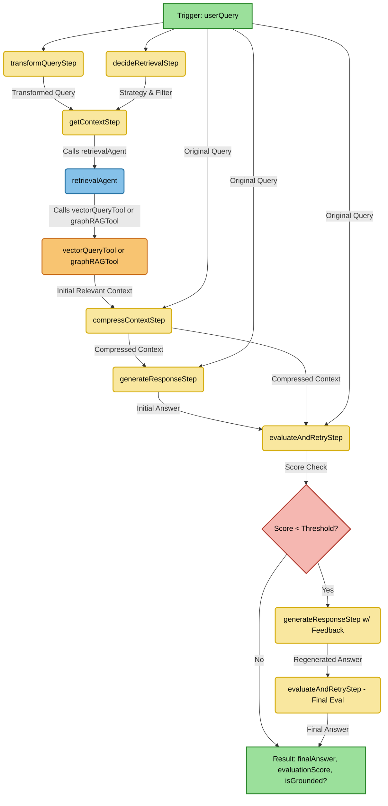

# ragger

This project implements a Retrieval-Augmented Generation (RAG) system using the Mastra TypeScript framework to answer user queries about a specific codebase. It's designed to work with [embedder](https://github.com/mark-hingston/embedder) which creates vector embeddings stored in Qdrant.

**Core Functionality:**

*   **Retrieval-Augmented Generation (RAG):** Answers user queries using relevant context retrieved from a codebase vector store.
*   **Vector Store:** Uses Qdrant for efficient storage and retrieval of code embeddings.
*   **LLM Integration:** Utilises OpenAI models (like GPT-4o and GPT-4o Mini) via the Vercel AI SDK integration within Mastra for embedding generation, routing decisions, final answer generation, and evaluation.
*   **Query Transformation:** Uses `transformQueryStep` (which calls `queryTransformerAgent`) to potentially rephrase or enhance the `userQuery` for better retrieval.
*   **Context Compression:** Uses `compressContextStep` (which calls `contextCompressorAgent`) to process the initial `relevantContext` and the original `userQuery`, extracting the most important information into a potentially smaller, more focused `compressedContext`.
*   **Dynamic Retrieval Routing:** An agent analyses the user query to decide between basic semantic search and metadata-filtered search in Qdrant.
*   **Internal Re-ranking:** The `vectorQueryTool` internally re-ranks initial search results using the configured LLM provider before returning the final context, improving relevance without a separate external call.
*   **LLM-as-a-Judge Evaluation:** Evaluates the generated answer's quality (accuracy, relevance, completeness) based on the query and retrieved context using a dedicated evaluation agent.
*   **Conditional Retry:** If the initial answer evaluation score is below a threshold, the system attempts to regenerate the answer using the context and feedback about the previous low score.
*   **Workflow Orchestration:** Uses Mastra's vNext Workflow engine (`createWorkflow`, `createStep`, `.map().then()`) to manage the multi-step RAG process.

## Technology Stack

*   **Framework:** Mastra (`@mastra/core`, `@mastra/rag`, `@mastra/evals`)
*   **LLM Provider:** OpenAI (`@ai-sdk/openai`) via Vercel AI SDK
*   **Vector Database:** Qdrant (`@qdrant/js-client-rest`)
*   **Schema Validation:** Zod (`zod`)
*   **Language:** TypeScript
*   **Runtime:** Node.js

## Prerequisites

*   Node.js (v20.x or later recommended)
*   npm, pnpm, or yarn
*   Access to a Qdrant instance (e.g., self-hosted, cloud, Azure Container Apps)
*   OpenAI API Key

## Installation

1.  Clone the repository (if applicable).
2.  Navigate to the project directory.
3.  Install dependencies:
    ```bash
    npm install
    # or
    # yarn install
    # or
    # pnpm install
    ```

## Environment Variable Setup

Create a `.env` file in the project root and populate it with your credentials and configuration:

```dotenv
# LLM Provider Configuration (Currently targetting Azure OpenAI)
LLM_PROVIDER_RESOURCE_NAME=your_azure_resource
LLM_DEPLOYMENT=your_deployment
RERANK_DEPLOYMENT=your_deployment
LLM_PROVIDER_API_KEY=sk-xxxxxxxxxxxxxxxxxxxxxxxxxxxxxxxxxxxxxxxx # Your API key for the LLM provider

# Embedding Provider Configuration (Can be the same or different from LLM)
EMBEDDING_PROVIDER_NAME=custom
EMBEDDING_PROVIDER_BASE_URL=https://api.openai.com/v1 # Adjust if needed
EMBEDDING_PROVIDER_API_KEY=sk-xxxxxxxxxxxxxxxxxxxxxxxxxxxxxxxxxxxxxxxx # Your API key for the embedding provider
EMBEDDING_MODEL=text-embedding-3-small # The specific model for text embeddings
EMBEDDING_DIMENSIONS=1536 # Dimensions of the chosen embedding model (e.g., 1536 for text-embedding-3-small)

# Qdrant Configuration
QDRANT_HOST=localhost # Hostname or IP of your Qdrant instance
QDRANT_PORT=6333 # Port Qdrant is running on
QDRANT_API_KEY=your_qdrant_api_key # Optional: API key if Qdrant requires authentication
QDRANT_USE_HTTPS=false # Set to true if Qdrant uses HTTPS
QDRANT_COLLECTION_NAME=your_codebase_collection_name # IMPORTANT: Name of your Qdrant collection

# Workflow Configuration
RETRY_THRESHOLD=0.6 # Score below which the workflow will attempt to retry generation
```

**Important:** Ensure `QDRANT_COLLECTION_NAME` matches the name of the collection where your code embeddings are stored, and `EMBEDDING_DIMENSIONS` matches your chosen `EMBEDDING_MODEL`.

## Running Locally (Development)

1.  Ensure your Qdrant instance is running and accessible.
2.  Make sure your `.env` file is correctly configured.
3.  Start the Mastra development server:
    ```bash
    npm run dev
    # or yarn dev, pnpm dev
    ```
    This typically starts the server on `http://localhost:4111`.
4.  The server exposes API endpoints for the defined agents and workflows. You can interact with them using tools like `curl`, Postman, or the Mastra Dev Playground UI (usually accessible at the server's base URL).

## Workflow Overview (`ragWorkflow`)

The `ragWorkflow` is orchestrated by the `workflowAgent`. The core logic within the workflow is as follows:

1.  **Trigger:** The `workflowAgent` receives the `userQuery` and triggers the `ragWorkflow` using the `ragWorkflowTool`. The workflow then receives the `userQuery`.
2.  **Transform Query:** Uses `transformQueryStep` (which calls `queryTransformerAgent`) to potentially rephrase or enhance the `userQuery` for better retrieval.
3.  **Decide Retrieval:** Uses `decideRetrievalStep` (which calls `retrievalRouterAgent`, fed the original `userQuery`) to determine the retrieval `strategy` (e.g., 'basic', 'metadata', 'graph', 'documentation', 'example', 'hierarchical') and potentially a Qdrant `filter`.
4.  **Get Context (Conditional Retrieval & Reranking):** This central step (`getContextStep`) calls the `retrievalAgent`, passing the *transformed* query, the original `userQuery`, the determined `strategy`, and the `filter`. The `retrievalAgent` is invoked with an explicit `toolChoice` option to select either `vectorQueryTool` or `graphRAGTool` based on the `strategy`. The *transformed* query is used as the input for the selected tool.
    *   **If `strategy` is 'graph':** The `retrievalAgent` is instructed to use `graphRAGTool`.
    *   **Otherwise (e.g., 'basic', 'metadata', 'documentation', 'example', 'hierarchical'):** The `retrievalAgent` is instructed to use `vectorQueryTool`. This tool performs a vector search using the embedding of the *transformed* query and the provided `filter` (if applicable). Crucially, `vectorQueryTool` is configured with an *internal re-ranker* which automatically re-ranks the initial vector search results using the configured re-ranker LLM before returning the initial `relevantContext`.
5.  **Compress Context:** Uses `compressContextStep` (which calls `contextCompressorAgent`) to process the initial `relevantContext` and the original `userQuery`, extracting the most important information into a potentially smaller, more focused `compressedContext`.
6.  **Generate Response:** Uses `generateResponseStep` (which calls `ragAgent`), providing the original `userQuery` and the `compressedContext`, to generate an initial answer.
7.  **Evaluate & Retry:**
    *   Uses `evaluateAndRetryStep` (which calls `evaluationAgent`) to score the generated answer against the original query and the `compressedContext`.
    *   Performs a basic groundedness check.
    *   **If the score < `RETRY_THRESHOLD` (0.6):** Regenerates the answer using `generateResponseStep` (calling `ragAgent` again), providing the original query, `compressedContext`, the *previous low-scoring answer*, and instructions to improve. The regenerated answer is then evaluated again by `evaluateAndRetryStep`.
    *   Outputs the final answer (either the initial one if the score was high enough, or the regenerated one) along with its final evaluation score and groundedness status.

### Workflow Diagram (Mermaid)



*Note: The interaction between `getContextStep` and `retrievalAgent` involves passing structured strategy and filter data.

## How to Use

Once the development server is running (`mastra dev`), you can interact with the `workflowAgent` to trigger the `ragWorkflow`.

The `workflowAgent` is typically exposed via an API endpoint. You can interact with it using tools like `curl`, Postman, or the Mastra Dev Playground UI (usually accessible at the server's base URL).

**Example Interaction (using a hypothetical agent endpoint):**

Assuming the `workflowAgent` is exposed at `/api/agents/workflowAgent/run`, you could trigger it with a POST request:

**Endpoint:** `POST /api/agents/workflowAgent/run`
**Method:** `POST`
**Headers:** `Content-Type: application/json`
**Body:**

```json
{
  "input": {
    "userQuery": "How is authentication handled in the WebApi?"
  }
}
```

The agent will process the input and use the `ragWorkflowTool` to start the workflow. The server will execute the workflow asynchronously. You would typically need another mechanism (like polling a status endpoint or websockets, if implemented) to get the final result (`finalAnswer`, `evaluationScore`, `isGrounded`). The console logs during `mastra dev` will show the progress and final evaluation.

## Deployment

1.  **Build:** Run `npm run build` (or equivalent). This uses `mastra build` to create a production-ready Node.js server in the `.mastra/output` directory.
2.  **Containerize:** Create a Dockerfile to package the `.mastra/output` directory and its dependencies.
3.  **Deploy:** Deploy the container image to your preferred hosting platform (e.g., Azure Container Apps, Azure App Service, Kubernetes).
    *   Ensure network connectivity between the deployed Mastra application and your Qdrant instance on Azure Container Apps.
    *   Configure all necessary environment variables in your deployment environment.