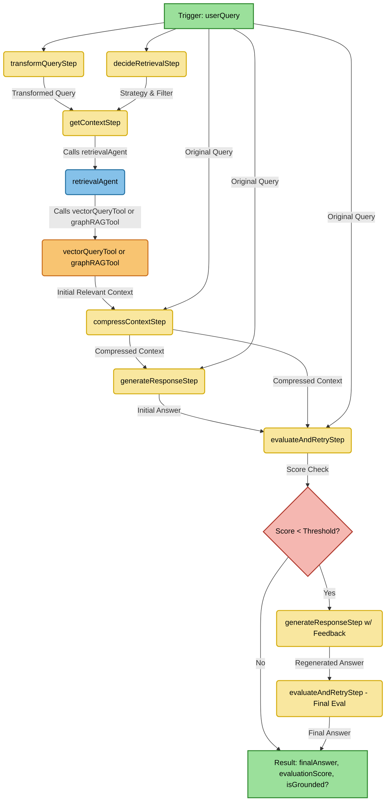

## File: src/mastra/tools/graphRAGTool.ts
````typescript
import { createGraphRAGTool } from "@mastra/rag";
import { env } from "../../config";
import { embeddingModel } from "../providers";
import { QDRANT_STORE_NAME } from "../../config";

export const graphRAGTool = createGraphRAGTool({
  id: "graphRAGTool",
  description: "Access and analyse relationships between information...",
  vectorStoreName: QDRANT_STORE_NAME,
  indexName: env.QDRANT_COLLECTION_NAME,
  model: embeddingModel,
  graphOptions: {
    dimension: env.EMBEDDING_DIMENSIONS,
    threshold: 0.7,
    randomWalkSteps: 100,
    restartProb: 0.15,
  },
});
````

## File: src/mastra/tools/index.ts
````typescript
import { vectorQueryTool } from "./vectorQueryTool";
import { graphRAGTool } from "./graphRAGTool";

export { vectorQueryTool, graphRAGTool };
````

## File: src/mastra/utils/errorUtils.ts
````typescript
import { WorkflowError } from "../errors";

/**
 * Determines if an error is potentially retryable.
 * Checks for specific HTTP status codes and common network error messages.
 * @param error The error object.
 * @returns True if the error is retryable, false otherwise.
 */
export function isRetryableError(error: any): boolean {
  if (!error) {
    return false;
  }

  if (error instanceof WorkflowError) {
    return error.isRetryable;
  }

  if (typeof error.status === 'number') {
    if (error.status === 429 || error.status >= 500) {
      return true;
    }
  }

  if (error instanceof Error) {
    const message = error.message.toLowerCase();
    if (
      message.includes("econnrefused") ||
      message.includes("timeout") ||
      message.includes("network error") ||
      message.includes("fetch failed")
    ) {
      return true;
    }
  }

  return false;
}
````

## File: src/mastra/workflows/steps/compressContextStep.ts
````typescript
import { createStep } from "@mastra/core/workflows/vNext";
import { z } from "zod";
import { CONTEXT_COMPRESSOR_AGENT_NAME } from "../../agents/contextCompressorAgent";
import { WorkflowError } from "../../errors";
import { isRetryableError } from "../../utils/errorUtils";
import { env } from "../../../config";

// Helper to parse the string context back into snippets
function parseContextSnippets(contextString: string): { filePath: string; content: string }[] {
    const snippets = [];
    const snippetRegex = /File: (.*?)\n```\n(.*?)\n```\n---/gs;
    let match;
    while ((match = snippetRegex.exec(contextString)) !== null) {
        snippets.push({ filePath: match[1].trim(), content: match[2].trim() });
    }
    return snippets;
}


export const compressContextStep = createStep({
  id: "compressContext",
  inputSchema: z.object({
    userQuery: z.string(),
    relevantContext: z.string(), // This is the stringified context from getContextStep
  }),
  outputSchema: z.object({
    finalCompressedContext: z.string(),
  }),
  execute: async ({ inputData, mastra, runtimeContext }) => {
    console.debug(`Executing step: ${compressContextStep.id}`);
    const { userQuery, relevantContext } = inputData;

    if (!env.CONTEXTUAL_COMPRESSION_ENABLED) {
      console.log("[CompressContextStep] Contextual compression is disabled. Using original context.");
      return { finalCompressedContext: relevantContext };
    }

    if (!relevantContext || relevantContext.trim() === "") {
        console.log("[CompressContextStep] No context to compress.");
        return { finalCompressedContext: "" };
    }

    try {
      const agent = mastra?.getAgent(CONTEXT_COMPRESSOR_AGENT_NAME);
      if (!agent) {
        throw new Error(`Agent '${CONTEXT_COMPRESSOR_AGENT_NAME}' not found.`);
      }

      const snippets = parseContextSnippets(relevantContext);
      if (snippets.length === 0) {
        console.log("[CompressContextStep] Could not parse any snippets from context. Using original context.");
        return { finalCompressedContext: relevantContext };
      }

      const compressedSnippets: string[] = [];
      console.log(`[CompressContextStep] Compressing ${snippets.length} context snippets...`);

      for (const snippet of snippets) {
        const prompt = `User Query: ${userQuery}\n\nContext Snippet (from file ${snippet.filePath}):\n${snippet.content}\n\nRelevant parts:`;
        try {
            const response = await agent.generate(prompt, {
                output: z.object({ compressedSnippet: z.string() }),
                runtimeContext,
            });
            if (response.object.compressedSnippet.trim() !== "") {
                compressedSnippets.push(`File: ${snippet.filePath}\n\`\`\`\n${response.object.compressedSnippet.trim()}\n\`\`\`\n---`);
            }
        } catch (compressionError) {
            console.warn(`[CompressContextStep] Error compressing snippet from ${snippet.filePath}: ${compressionError}. Skipping this snippet.`);
        }
      }

      const finalCompressedContext = compressedSnippets.join('');
      console.log(`[CompressContextStep] Compression complete. Original length: ${relevantContext.length}, Compressed length: ${finalCompressedContext.length}`);
      return { finalCompressedContext };

    } catch (error) {
      console.error(`Error in step ${compressContextStep.id}:`, error);
      const isRetryable = isRetryableError(error);
      throw new WorkflowError(
        `Failed to compress context in step ${compressContextStep.id}: ${error instanceof Error ? error.message : String(error)}`,
        isRetryable
      );
    }
  },
});
````

## File: src/mastra/workflows/steps/decideRetrievalStep.ts
````typescript
import { isRetryableError } from "../../utils/errorUtils";
import { createStep } from "@mastra/core/workflows/vNext";
import { z } from "zod";
import { retrievalDecisionSchema } from "../../agents";
import { RETRIEVAL_ROUTER_AGENT_NAME } from "../../agents/retrievalRouterAgent";
import { WorkflowError } from "../../errors";

// 3. Decide Retrieval Strategy
export const decideRetrievalStep = createStep({
  id: "decideRetrieval",
  inputSchema: z.object({ userQuery: z.string() }),
  outputSchema: retrievalDecisionSchema,
  execute: async ({ inputData, mastra, runtimeContext }) => {
    console.debug(`Executing step: ${decideRetrievalStep.id}`);
    try {
      const agent = mastra?.getAgent(RETRIEVAL_ROUTER_AGENT_NAME);
      if (!agent)
        throw new Error("RetrievalRouterAgent not found in Mastra instance.");

      console.log(
        "Calling Retrieval Router Agent for query:",
        inputData.userQuery
      );
      const response = await agent.generate(inputData.userQuery, {
        output: retrievalDecisionSchema,
        runtimeContext,
      });
      console.log("Retrieval Router Agent decision:", response.object);
      return response.object;
    } catch (error) {
      console.error(`Error in step ${decideRetrievalStep.id}:`, error);
      const isRetryable = isRetryableError(error);

      throw new WorkflowError(
        `Failed to decide retrieval strategy in step ${decideRetrievalStep.id}: ${error instanceof Error ? error.message : String(error)}`,
        isRetryable
      );
    }
  },
});
````

## File: src/mastra/workflows/steps/generateResponseStep.ts
````typescript
import { isRetryableError } from "../../utils/errorUtils";
import { createStep } from "@mastra/core/workflows/vNext";
import { z } from "zod";
import { RAG_AGENT_NAME } from "../../agents/ragAgent";
import { WorkflowError } from "../../errors";

// 4. Generate Response (Initial)
export const generateResponseStep = createStep({
  id: "generateResponse",
  inputSchema: z.object({
    userQuery: z.string(),
    relevantContext: z.string(),
  }),
  outputSchema: z.object({ answer: z.string() }),
  execute: async ({ inputData, mastra, runtimeContext }) => {
    console.debug(`Executing step: ${generateResponseStep.id}`);
    try {
      const agent = mastra?.getAgent(RAG_AGENT_NAME);
      if (!agent) throw new Error("RagAgent not found in Mastra instance.");

      const { userQuery, relevantContext } = inputData;
      const prompt = `User Query: ${userQuery}\n\nContext:\n${relevantContext}\n\nAnswer:`;
      const response = await agent.generate(prompt, { runtimeContext });
      return { answer: response.text };
    } catch (error) {
      console.error(`Error in step ${generateResponseStep.id}:`, error);
      const isRetryable = isRetryableError(error);

      throw new WorkflowError(
        `Failed to generate initial response in step ${generateResponseStep.id}: ${error instanceof Error ? error.message : String(error)}`,
        isRetryable
      );
    }
  },
});
````

## File: src/mastra/workflows/steps/transformQueryStep.ts
````typescript
import { createStep } from "@mastra/core/workflows/vNext";
import { z } from "zod";
import { QUERY_TRANSFORMER_AGENT_NAME } from "../../agents/queryTransformerAgent";
import { WorkflowError } from "../../errors";
import { isRetryableError } from "../../utils/errorUtils";
import { env } from "../../../config";

export const transformQueryStep = createStep({
  id: "transformQuery",
  inputSchema: z.object({
    userQuery: z.string(),
  }),
  // Output can be a single string or an object with sub-queries
  outputSchema: z.object({
    transformedQuery: z.string(), // For simplicity, assume single string output for now
    // originalQuery: z.string(),
    // subQueries: z.array(z.string()).nullable(),
  }),
  execute: async ({ inputData, mastra, runtimeContext }) => {
    console.debug(`Executing step: ${transformQueryStep.id}`);
    const { userQuery } = inputData;

    if (env.QUERY_TRANSFORMATION_TYPE === 'none') {
      console.log("[TransformQueryStep] Query transformation is disabled. Using original query.");
      return { transformedQuery: userQuery };
    }

    try {
      const agent = mastra?.getAgent(QUERY_TRANSFORMER_AGENT_NAME);
      if (!agent) {
        throw new Error(`Agent '${QUERY_TRANSFORMER_AGENT_NAME}' not found.`);
      }

      console.log(`[TransformQueryStep] Transforming query: "${userQuery}" using type: ${env.QUERY_TRANSFORMATION_TYPE}`);
      // The agent's prompt should be designed to handle different transformation types
      const response = await agent.generate(
        `User Query: ${userQuery}\nTransformation Type: ${env.QUERY_TRANSFORMATION_TYPE}`,
        {
          // Adjust output schema based on agent's capability for sub-queries if implemented
          output: z.object({ rewrittenQuery: z.string() }),
          runtimeContext,
        }
      );

      console.log(`[TransformQueryStep] Transformed query: "${response.object.rewrittenQuery}"`);
      return { transformedQuery: response.object.rewrittenQuery };

    } catch (error) {
      console.error(`Error in step ${transformQueryStep.id}:`, error);
      const isRetryable = isRetryableError(error);
      throw new WorkflowError(
        `Failed to transform query in step ${transformQueryStep.id}: ${error instanceof Error ? error.message : String(error)}`,
        isRetryable
      );
    }
  },
});
````

## File: src/mastra/errors.ts
````typescript
/**
 * Custom error class for workflow steps.
 * Allows indicating whether an error is potentially retryable.
 */
export class WorkflowError extends Error {
  readonly isRetryable: boolean;

  constructor(message: string, isRetryable = false) {
    super(message);
    this.name = "WorkflowError";
    this.isRetryable = isRetryable;

    // Ensure the prototype chain is correctly set for instanceof checks
    Object.setPrototypeOf(this, WorkflowError.prototype);
  }
}
````

## File: tsconfig.json
````json
{
  "compilerOptions": {
    "target": "ES2022",
    "module": "ES2022",
    "moduleResolution": "bundler",
    "esModuleInterop": true,
    "forceConsistentCasingInFileNames": true,
    "strict": true,
    "skipLibCheck": true,
    "noEmit": true,
    "outDir": "dist"
  },
  "include": [
    "src/**/*"
  ]
}
````

## File: src/mastra/agents/contextCompressorAgent.ts
````typescript
import { Agent } from "@mastra/core/agent";
import { z } from "zod";
import { llmModel } from "../providers"; // Assuming llmModel is suitable

export const CONTEXT_COMPRESSOR_AGENT_NAME = "contextCompressorAgent";

export const contextCompressorAgent = new Agent({
  name: CONTEXT_COMPRESSOR_AGENT_NAME,
  model: llmModel, // Or a specific model for summarization/extraction
  instructions: `You are an expert at extracting relevant information.
Given a User Query and a Context Snippet (which will include its file path), your task is to extract *only* the sentences or lines from the Snippet that are directly relevant to answering the User Query.
Maintain the original wording and code formatting as much as possible.
If no part of the Snippet is relevant, output an empty string.

Respond ONLY with the relevant parts of the snippet. Do not add any explanation.`,
  defaultGenerateOptions: {
    output: z.object({ compressedSnippet: z.string() }),
  },
});
````

## File: src/mastra/agents/queryTransformerAgent.ts
````typescript
import { Agent } from "@mastra/core/agent";
import { z } from "zod";
import { llmModel } from "../providers";

export const QUERY_TRANSFORMER_AGENT_NAME = "queryTransformerAgent";

export const queryTransformerAgent = new Agent({
  name: QUERY_TRANSFORMER_AGENT_NAME,
  model: llmModel,
  instructions: `You are an expert query rewriter. Your task is to rewrite a user query to be more effective for searching a codebase vector store.
Focus on using precise keywords, clarifying ambiguity, and structuring the query for better semantic matching.
Consider the 'Transformation Type' that will be provided:
- If 'rewrite': Provide a single, improved query.
- If 'sub_queries': Decompose the complex query into 2-3 simpler, self-contained sub-queries. If the query is already simple, return it as the single rewritten query.
- If 'none' or unknown: Return the original query.

Respond ONLY with the rewritten query string.
Example for 'rewrite':
User Query: how to use auth
Transformation Type: rewrite
Rewritten Query: "example implementation of authentication flow"

Example for 'sub_queries':
User Query: explain auth and find user model
Transformation Type: sub_queries
Rewritten Query: (If outputting JSON: { "originalQuery": "...", "subQueries": ["explain authentication flow", "find user model class definition"] })
                  (If outputting single string for now: "explain authentication flow and find user model class definition")

`,
  defaultGenerateOptions: {
    output: z.object({ rewrittenQuery: z.string() }),
  },
});
````

## File: src/mastra/tools/ragWorkflowTool.ts
````typescript
import { createTool } from "@mastra/core/tools";
import { RAG_WORKFLOW_ID, ragWorkflow } from "../workflows/ragWorkflow";

export const ragWorkflowTool = createTool({
  id: "triggerRagWorkflowTool",
  description: "Triggers the RAG workflow to process the user's query and get a comprehensive answer.",
  inputSchema: ragWorkflow.inputSchema,
  outputSchema: ragWorkflow.outputSchema,
  execute: async ({ context, mastra }) => {
    const workflow = mastra?.vnext_getWorkflow(RAG_WORKFLOW_ID);

    if (!workflow) {
      throw new Error("Workflow not found.");
    }
    
    try {
      const run = ragWorkflow.createRun();
      const results = await run.start({
        inputData: {
          userQuery: context.userQuery
        },
      });
      
      if (results.status !== "success") {
        if (results.status === "failed") {
          throw new Error(`Workflow execution failed: ${results.error?.message || 'Unknown error'}`);
        }
        throw new Error(`Workflow execution failed with status: ${results.status}`);
      }

      const evaluateAndRetryResult = results.steps.evaluateAndRetry;

      if (evaluateAndRetryResult.status === "success") {
        return evaluateAndRetryResult.output;
      } else {
        
        if (evaluateAndRetryResult.status === "failed") {
          throw new Error(`RAG workflow step 'evaluateAndRetry' failed: ${evaluateAndRetryResult.error}`);
        } else {
          throw new Error(`RAG workflow step 'evaluateAndRetry' was not successful (status: ${evaluateAndRetryResult.status})`);
        }
      }

    } catch (error) {
      console.error("Error executing RAG workflow via tool:", error);
      throw new Error(`Failed to process query through RAG workflow: ${error instanceof Error ? error.message : String(error)}`);
    }
  },
});
````

## File: src/mastra/utils/tokenProcessor.ts
````typescript
import natural from 'natural';
const PorterStemmer = natural.PorterStemmer;

// Define a default set of stop words (Copied exactly from embedder/src/vocabularyBuilder.ts)
const DEFAULT_STOP_WORDS: Set<string> = new Set([
  // Common English stop words
  "a", "an", "and", "are", "as", "at", "be", "but", "by", "for", "if", "in", "into", "is", "it", "its", "no", "not", "of", "on", "or", "such", "that", "the", "their", "then", "there", "these", "they", "this", "to", "was", "will", "with", "about", "after", "all", "also", "am", "any", "because", "been", "before", "being", "can", "could", "did", "do", "does", "doing", "from", "further", "had", "has", "have", "he", "her", "here", "him", "his", "how", "however", "i", "just", "let", "me", "my", "myself", "nor", "our", "ours", "ourselves", "out", "over", "own", "same", "she", "should", "so", "some", "than", "thats", "them", "themselves", "those", "though", "through", "thus", "too", "us", "very", "we", "were", "what", "when", "where", "which", "while", "who", "whom", "why", "would", "you", "your", "yours", "yourself", "yourselves", "yet",
  "test", "month", // Added as per review

  // Common programming keywords
  "abstract", "arguments", "async", "await", "boolean", "break", "case", "catch", "class", "const", "constructor", "continue", "debugger", "default", "delete", "else", "enum", "export", "extends", "false", "finally", "for", "function", "get", "implements", "import", "instanceof", "interface", "internal", "module", "new", "null", "object", "override", "package", "private", "protected", "public", "readonly", "record", "return", "sealed", "set", "static", "super", "switch", "synchronized", "this", "throw", "throws", "transient", "true", "try", "type", "typeof", "undefined", "var", "virtual", "void", "volatile", "while", "yield", "using", "namespace", "task", "int", "bool",

  // Logging & Console
  "console", "log", "warn", "error", "debug", "info",

  // Operators & Symbols (many might be filtered by TreeSitter node types or length) - keep minimal
  // "==", "===", "!=", "!==", ">", "<", ">=", "<=", "&&", "||", "!", "++", "--", "+", "-", "*", "/", "%", "+=", "-=", "*=", "/=", "%=", "?", "??", "?.", ":", "=>", "=",

  // Punctuation - mostly handled by cleaning, but some explicit ones if they form tokens
  // ".", ",", ";", "(", ")", "{", "}", "[", "]", "///", "//", "/*", "*/",

  // XML-like tags (if they become tokens despite TreeSitter)
  "summary", "param", "inheritdoc", "remarks", "returns", "exception", "typeparam", "see", "cref",

  // Common build/config/file terms (if not desired)
  "commit", "file", "path", "line", "index", "src", "dist", "ref", "refs", "head", "github", "workspace", "version", "name", "value", "target", "property", "itemgroup", "project", "sdk", "framework", "dependency", "echo", "bash", "run", "uses", "env", "steps", "script", "args", "output", "input", "displayname", "workingdirectory", "parameters", "variables", "http", "https", "api", "status", "message", "header", "content", "body", "docker", "image", "container", "deployment", "service", "ingress", "configmap", "secret", "volume", "mountpath", "replicas", "metadata", "labels", "spec", "kind", "apiversion",

  // Specific terms identified as noise from previous vocabularies
  "string", "context", "form", "number", "action", "text", "button", "label", "option", "json", "model", "config", "logger", "list", "item", "brand", "url", "view", "post", "host", "base", // Added view, post, host, base

  // Generic/Common Programming Terms and Project Acronyms (add more if they are noisy)
  "obj", "cpu", "commo", "utilitie", "client", "server", "user", "system", "data", "code", "key",
  "trin", "pguk", "eac", "pgsa",

  // JSON Keys (if they become separate tokens and are noisy)
  "term_plural", "fuzzy",

  // Test-Specific Terms and Common Low-Signal Words (many should be filtered by length or are actual stop words)
  "tobeinthedocument", "tohavebeencalled", "tobevisible", "tobehidden", "userevent", "expect", "div", "span", "id",
  "includeassets", "buildtransitive", "runtime", "screen", "page", "locator", "purchasepage", "valid_card_details", "styledth", "styledtd",
]);

// Helper function to split camelCase and snake_case words (Copied exactly from embedder/src/vocabularyBuilder.ts)
function splitCompoundIdentifier(token: string): string[] {
  if (token.includes('-') || token.includes('_')) { // Handle snake_case and kebab-case
    return token.split(/[-_]/).filter(t => t.length > 0);
  }
  // Split camelCase: Credit to https://stackoverflow.com/a/76279304/1089576
  const words = token.match(/([A-Z_]?([a-z0-9]+)|[A-Z_]+)/g);
  return words ? words.map(w => w.replace(/^_/, '')) : [token];
}

/**
 * Processes raw text through the full tokenization, cleaning, filtering, and stemming pipeline.
 * This function encapsulates the logic previously found in embedder/src/vocabularyBuilder.ts.
 * @param text The raw input text (e.g., code chunk or query string).
 * @returns An array of processed, stemmed, and filtered tokens.
 */
export function processTextToFinalTokens(text: string): string[] {
  const stemmer = PorterStemmer;

  // Replicate the initial splitting logic from vocabularyBuilder, adapted for a raw string input
  const initialTokens = text
    .replace(/[\r\n]+/g, " ; ") // Normalize newlines to a consistent separator
    .split(/\s*;\s*/) // Split by the separator, allowing for surrounding whitespace
    .map((t) => t.trim())
    .filter((t) => t.length > 0);

  const processedTokensFinal: string[] = [];

  for (const originalToken of initialTokens) {
    let tokensForCompoundSplitting: string[];
    // Only apply compound splitting to tokens that look like identifiers and are reasonably long
    if (/^[a-zA-Z0-9]+([-_][a-zA-Z0-9]+)*$|^[a-z]+([A-Z][a-zA-Z0-9]*)+[a-zA-Z0-9]*$/.test(originalToken) && originalToken.length > 4) {
      tokensForCompoundSplitting = splitCompoundIdentifier(originalToken);
    } else {
      tokensForCompoundSplitting = [originalToken];
    }

    for (let tokenPartFromCompound of tokensForCompoundSplitting) {
      const dotParts = tokenPartFromCompound.split('.');
      for (const dotPart of dotParts) {
        if (dotPart.length === 0) continue;

        let cleanedSubToken = dotPart.toLowerCase();

        // Decode unicode escape sequences like \\uXXXX
        try {
          cleanedSubToken = cleanedSubToken.replace(
            /\\\\u([0-9a-fA-F]{4})/g,
            (match, grp) => String.fromCharCode(parseInt(grp, 16))
          );
        } catch (e) { /* ignore encoding errors */ }

        // Normalize newlines within the token (again, just in case) and trim
        cleanedSubToken = cleanedSubToken.replace(/[\r\n]+/g, " ").trim();

        // General cleaning of leading/trailing non-alphanumeric (but keep @#$_ internally for things like CSS vars or specific identifiers)
        cleanedSubToken = cleanedSubToken.replace(/^[^a-z0-9@#$_]+|[^a-z0-9@#$_]+$/g, "");
        // Remove any leading underscores that might remain or be part of the original token
        cleanedSubToken = cleanedSubToken.replace(/^_+/, "");

        // --- SPECIALIZED FILTERS (Applied after basic cleaning, before general stop word/length checks) ---

        // Filter for attribute-like tokens, e.g. name="value", name=\"value\"
        // or fragments like name="value (if trailing quote was stripped by previous cleaning)
        if (cleanedSubToken.includes('="') || cleanedSubToken.includes('=\\"')) {
          continue;
        }

        // Filter for <tag> style tokens (simple complete ones like <summary> or <br/>)
        if (/^<[a-zA-Z0-9_:\-\.\/]+>$/.test(cleanedSubToken)) {
            continue;
        }

        // Filter for tokens containing markup characters (<, >) mixed with other content or partial tags
        // Examples: "includeassets>runtim", "buildtransitive</includeasset", "foo<bar"
        if (/[<>]/.test(cleanedSubToken)) {
            const knownOperatorsWithMarkup = /^(?:=>|<=|>=|->)$/; // Add others if necessary
            if (DEFAULT_STOP_WORDS.has(cleanedSubToken) || knownOperatorsWithMarkup.test(cleanedSubToken)) {
                // It's a stop word (like "=>") or a known operator.
                // Let it pass this specific filter; it will be handled by the main stop word/length filters later.
            } else {
                // It contains < or > and is not a recognized operator/stopword.
                // This is likely an undesirable fragment.
                continue;
            }
        }

        // Filter tokens with internal brackets/braces/parentheses if they don't fully enclose the token
        // (e.g. "func(tion" but not "(param)")
        if (/[()\[\]{}]/.test(cleanedSubToken) && !cleanedSubToken.startsWith("(") && !cleanedSubToken.endsWith(")")) {
          continue;
        }
        // Filter relative paths like ../../file.txt or ./src
        if (/^(?:\.\.\/|\.\/)+[\w\-\/\.]+$/.test(cleanedSubToken)) {
            continue;
        }
        // Filter numbers ending with punctuation like "123," or "456;"
        if (/^[0-9]+[;,]$/.test(cleanedSubToken)) {
            continue;
        }

        // Filter for specific JSON-like fragments (this was quite specific, review if still needed after other changes)
        if (
          cleanedSubToken.includes('":"') &&
          cleanedSubToken.includes('","') &&
          (cleanedSubToken.includes(":0") || cleanedSubToken.includes(":1"))
        ) {
          if (
            cleanedSubToken.length > 30 ||
            cleanedSubToken.includes("term_plural") || // These are also stop words
            cleanedSubToken.includes("fuzzy") ||       // These are also stop words
            cleanedSubToken.includes('context":""')
          ) {
            continue;
          }
        }

        // --- PRIMARY FILTERING (Stop words, pure numbers, very short tokens on *cleaned* token) ---
        if (
          DEFAULT_STOP_WORDS.has(cleanedSubToken) ||
          /^\d+(\.\d+)?$/.test(cleanedSubToken) || // Is purely numeric (e.g., "123", "4.56")
          cleanedSubToken.length <= 1 // Filter single characters (e.g., "x", "_")
        ) {
          continue;
        }

        let stemmedToken = cleanedSubToken;
        // Only stem if the token is reasonably long to avoid weird stemming of short words
        if (stemmer && stemmedToken.length > 2) {
          try {
            stemmedToken = stemmer.stem(stemmedToken);
          } catch (e) {
            console.warn(`Stemming failed for token '${cleanedSubToken}' (original) -> '${stemmedToken}': ${e}`);
          }
        }

        // --- FINAL FILTERING (Stop words on *stemmed* token, length) ---
        if (
          DEFAULT_STOP_WORDS.has(stemmedToken) ||
          stemmedToken.length <= 2 // Filter 1 and 2 letter words (e.g., "pi", "da"). Consider stemmedToken.length <= 3 for more aggressive filtering.
        ) {
          continue;
        }
        processedTokensFinal.push(stemmedToken);
      }
    }
  }

  return processedTokensFinal;
}

// Export the stop words set as well, in case it's needed elsewhere (e.g., for debugging or visualization)
export { DEFAULT_STOP_WORDS };
````

## File: src/mastra/providers.ts
````typescript
import { createAzure } from '@ai-sdk/azure';
import { createOpenAICompatible } from "@ai-sdk/openai-compatible";
import { env } from "../config";

export const llmProvider = createAzure({
  resourceName: env.LLM_PROVIDER_RESOURCE_NAME,
  apiKey: env.LLM_PROVIDER_API_KEY,
});
export const llmModel = llmProvider(env.LLM_DEPLOYMENT);
export const rerankModel = llmProvider(env.RERANK_DEPLOYMENT);

export const embeddingProvider = createOpenAICompatible({
  name: env.EMBEDDING_PROVIDER_NAME,
  baseURL: env.EMBEDDING_PROVIDER_BASE_URL,
  apiKey: env.EMBEDDING_PROVIDER_API_KEY,
});
export const embeddingModel = embeddingProvider.textEmbeddingModel(
  env.EMBEDDING_MODEL
);
````

## File: src/mastra/qdrantFilter.ts
````typescript
/*
 * Copyright (c) 2025 Mastra AI, Inc.
 *
 * Licensed under the Elastic License 2.0 (ELv2);
 * you may not use this file except in compliance with the License.
 * You may obtain a copy of the License at
 *
 * https://www.elastic.co/licensing/elastic-license
 *
 * # Elastic License 2.0 (ELv2)
 *
 * Copyright (c) 2025 Mastra AI, Inc.
 *
 * **Acceptance**
 * By using the software, you agree to all of the terms and conditions below.
 *
 * **Copyright License**
 * The licensor grants you a non-exclusive, royalty-free, worldwide, non-sublicensable, non-transferable license to use, copy, distribute, make available, and prepare derivative works of the software, in each case subject to the limitations and conditions below
 *
 * **Limitations**
 * You may not provide the software to third parties as a hosted or managed service, where the service provides users with access to any substantial set of the features or functionality of the software.
 *
 * You may not move, change, disable, or circumvent the license key functionality in the software, and you may not remove or obscure any functionality in the software that is protected by the license key.
 *
 * You may not alter, remove, or obscure any licensing, copyright, or other notices of the licensor in the software. Any use of the licensor’s trademarks is subject to applicable law.
 *
 * **Patents**
 * The licensor grants you a license, under any patent claims the licensor can license, or becomes able to license, to make, have made, use, sell, offer for sale, import and have imported the software, in each case subject to the limitations and conditions in this license. This license does not cover any patent claims that you cause to be infringed by modifications or additions to the software. If you or your company make any written claim that the software infringes or contributes to infringement of any patent, your patent license for the software granted under these terms ends immediately. If your company makes such a claim, your patent license ends immediately for work on behalf of your company.
 *
 * **Notices**
 * You must ensure that anyone who gets a copy of any part of the software from you also gets a copy of these terms.
 *
 * If you modify the software, you must include in any modified copies of the software prominent notices stating that you have modified the software.
 *
 * **No Other Rights**
 * These terms do not imply any licenses other than those expressly granted in these terms.
 *
 * **Termination**
 * If you use the software in violation of these terms, such use is not licensed, and your licenses will automatically terminate. If the licensor provides you with a notice of your violation, and you cease all violation of this license no later than 30 days after you receive that notice, your licenses will be reinstated retroactively. However, if you violate these terms after such reinstatement, any additional violation of these terms will cause your licenses to terminate automatically and permanently.
 *
 * **No Liability**
 * As far as the law allows, the software comes as is, without any warranty or condition, and the licensor will not be liable to you for any damages arising out of these terms or the use or nature of the software, under any kind of legal claim.
 *
 * **Definitions**
 * The _licensor_ is the entity offering these terms, and the _software_ is the software the licensor makes available under these terms, including any portion of it.
 *
 * _you_ refers to the individual or entity agreeing to these terms.
 *
 * _your company_ is any legal entity, sole proprietorship, or other kind of organization that you work for, plus all organizations that have control over, are under the control of, or are under common control with that organization. _control_ means ownership of substantially all the assets of an entity, or the power to direct its management and policies by vote, contract, or otherwise. Control can be direct or indirect.
 *
 * _your licenses_ are all the licenses granted to you for the software under these terms.
 *
 * _use_ means anything you do with the software requiring one of your licenses.
 *
 * _trademark_ means trademarks, service marks, and similar rights.
 */

import { BaseFilterTranslator } from "@mastra/core/vector/filter";
import type {
  FieldCondition,
  VectorFilter,
  LogicalOperator,
  OperatorSupport,
} from "@mastra/core/vector/filter";

/**
 * Translates MongoDB-style filters to Qdrant compatible filters.
 *
 * Key transformations:
 * - $and -> must
 * - $or -> should
 * - $not -> must_not
 * - { field: { $op: value } } -> { key: field, match/range: { value/gt/lt: value } }
 *
 * Custom operators (Qdrant-specific):
 * - $count -> values_count (array length/value count)
 * - $geo -> geo filters (box, radius, polygon)
 * - $hasId -> has_id filter
 * - $nested -> nested object filters
 * - $hasVector -> vector existence check
 * - $datetime -> RFC 3339 datetime range
 * - $null -> is_null check
 * - $empty -> is_empty check
 */
export class QdrantFilterTranslator extends BaseFilterTranslator {
  private sanitizeRegex(pattern: string): string {
    return pattern.replace(/[-\/\\^$*+?.()|[\]{}]/g, "\\$&");
  }

  protected override isLogicalOperator(key: string): key is LogicalOperator {
    return (
      super.isLogicalOperator(key) || key === "$hasId" || key === "$hasVector"
    );
  }

  protected override getSupportedOperators(): OperatorSupport {
    return {
      ...BaseFilterTranslator.DEFAULT_OPERATORS,
      logical: ["$and", "$or", "$not"],
      array: ["$in", "$nin"],
      regex: ["$regex"],
      custom: [
        "$count",
        "$geo",
        "$nested",
        "$datetime",
        "$null",
        "$empty",
        "$hasId",
        "$hasVector",
      ],
    };
  }

  translate(filter?: VectorFilter): VectorFilter {
    if (this.isEmpty(filter)) return filter;
    this.validateFilter(filter);
    return this.translateNode(filter);
  }

  private createCondition(type: string, value: any, fieldKey?: string) {
    const condition = { [type]: value };
    return fieldKey ? { key: fieldKey, ...condition } : condition;
  }

  private translateNode(
    node: VectorFilter | FieldCondition,
    isNested: boolean = false,
    fieldKey?: string
  ): any {
    if (!this.isEmpty(node) && typeof node === "object" && "must" in node) {
      return node;
    }

    if (this.isPrimitive(node)) {
      if (node === null) {
        return { is_null: { key: fieldKey } };
      }
      return this.createCondition(
        "match",
        { value: this.normalizeComparisonValue(node) },
        fieldKey
      );
    }

    if (this.isRegex(node)) {
      throw new Error("Direct regex pattern format is not supported in Qdrant");
    }

    if (Array.isArray(node)) {
      return node.length === 0
        ? { is_empty: { key: fieldKey } }
        : this.createCondition(
            "match",
            { any: this.normalizeArrayValues(node) },
            fieldKey
          );
    }

    const entries = Object.entries(node as Record<string, any>);

    // Handle logical operators first
    const logicalResult = this.handleLogicalOperators(entries, isNested);
    if (logicalResult) {
      return logicalResult;
    }

    // Handle field conditions
    const { conditions, range, matchCondition } = this.handleFieldConditions(
      entries,
      fieldKey
    );

    if (Object.keys(range).length > 0) {
      conditions.push({ key: fieldKey, range });
    }

    if (matchCondition) {
      conditions.push({ key: fieldKey, match: matchCondition });
    }

    return this.buildFinalConditions(conditions, isNested);
  }

  private buildFinalConditions(conditions: any[], isNested: boolean): any {
    if (conditions.length === 0) {
      return {};
    } else if (conditions.length === 1 && isNested) {
      return conditions[0];
    } else {
      return { must: conditions };
    }
  }

  private handleLogicalOperators(
    entries: [string, any][],
    isNested: boolean
  ): any | null {
    const firstKey = entries[0]?.[0];

    if (
      firstKey &&
      this.isLogicalOperator(firstKey) &&
      !this.isCustomOperator(firstKey)
    ) {
      const [key, value] = entries[0]!;
      const qdrantOp = this.getQdrantLogicalOp(key);
      return {
        [qdrantOp]: Array.isArray(value)
          ? value.map((v) => this.translateNode(v, true))
          : [this.translateNode(value, true)],
      };
    }

    if (
      entries.length > 1 &&
      !isNested &&
      entries.every(
        ([key]) => !this.isOperator(key) && !this.isCustomOperator(key)
      )
    ) {
      return {
        must: entries.map(([key, value]) =>
          this.translateNode(value, true, key)
        ),
      };
    }

    return null;
  }

  private handleFieldConditions(
    entries: [string, any][],
    fieldKey?: string
  ): {
    conditions: any[];
    range: Record<string, any>;
    matchCondition: Record<string, any> | null;
  } {
    const conditions = [];
    let range: Record<string, any> = {};
    let matchCondition: Record<string, any> | null = null;

    for (const [key, value] of entries) {
      if (this.isCustomOperator(key)) {
        const customOp = this.translateCustomOperator(key, value, fieldKey);
        conditions.push(customOp);
      } else if (this.isOperator(key)) {
        // Pass the fieldKey to translateOperatorValue for operators that need it
        const opResult = this.translateOperatorValue(key, value, fieldKey);
        if (opResult?.range) { // Check if opResult is not null/undefined before accessing range
          Object.assign(range, opResult.range);
        } else {
          matchCondition = opResult;
        }
      } else {
        const nestedKey = fieldKey ? `${fieldKey}.${key}` : key;
        const nestedCondition = this.translateNode(value, true, nestedKey);

        if (nestedCondition.must) {
          conditions.push(...nestedCondition.must);
        } else if (!this.isEmpty(nestedCondition)) {
          conditions.push(nestedCondition);
        }
      }
    }

    return { conditions, range, matchCondition };
  }

  private translateCustomOperator(
    op: string,
    value: any,
    fieldKey?: string
  ): any {
    switch (op) {
      case "$count":
        const countConditions = Object.entries(value).reduce(
          (acc, [k, v]) => ({
            ...acc,
            [k.replace("$", "")]: v,
          }),
          {}
        );
        return { key: fieldKey, values_count: countConditions };
      case "$geo":
        const geoOp = this.translateGeoFilter(value.type, value);
        return { key: fieldKey, ...geoOp };
      case "$hasId":
        return { has_id: Array.isArray(value) ? value : [value] };
      case "$nested":
        return {
          nested: {
            key: fieldKey,
            filter: this.translateNode(value),
          },
        };
      case "$hasVector":
        return { has_vector: value };
      case "$datetime":
        return {
          key: fieldKey,
          range: this.normalizeDatetimeRange(value.range),
        };
      case "$null":
        return { is_null: { key: fieldKey } };
      case "$empty":
        return { is_empty: { key: fieldKey } };
      default:
        throw new Error(`Unsupported custom operator: ${op}`);
    }
  }

  private getQdrantLogicalOp(op: string): string {
    switch (op) {
      case "$and":
        return "must";
      case "$or":
        return "should";
      case "$not":
        return "must_not";
      default:
        throw new Error(`Unsupported logical operator: ${op}`);
    }
  }

  private translateOperatorValue(operator: string, value: any, fieldKey?: string): any {
    // The 'exists' operator needs the fieldKey, others might not.
    // Handle 'exists' specifically here as it's a bit different from standard value comparisons.
    if (operator === "exists") {
        if (!fieldKey) {
            throw new Error(`'exists' operator requires a field key.`);
        }
        // "$exists": true -> field should exist (not null)
        // "$exists": false -> field should not exist (is null)
        return value
            ? { must_not: [{ is_null: { key: fieldKey } }] }
            : { is_null: { key: fieldKey } };
    }

    const normalizedValue = this.normalizeComparisonValue(value);

    switch (operator) {
      case "$eq":
        return { value: normalizedValue };
      case "$ne":
        return { except: [normalizedValue] };
      case "$gt":
        return { range: { gt: normalizedValue } };
      case "$gte":
        return { range: { gte: normalizedValue } };
      case "$lt":
        return { range: { lt: normalizedValue } };
      case "$lte":
        return { range: { lte: normalizedValue } };
      case "$in":
        return { any: this.normalizeArrayValues(value) };
      case "$nin":
        return { except: this.normalizeArrayValues(value) };
      case "$regex":
        // Sanitize the regex pattern and format for Qdrant text match
        const sanitizedPattern = this.sanitizeRegex(value);
        return {
          match: {
            text: sanitizedPattern,
            // allow_errors: false // Or true based on requirements - keeping as false for now
          },
        };
      default:
        // For other operators, return the match or range condition
        // Note: Range conditions are handled separately in handleFieldConditions
        // This method primarily translates value-based match conditions.
        // If we reach here with an operator that should be handled, it's an error in logic or unsupported.
        throw new Error(`Unsupported operator or incorrect handling: ${operator}`);
    }
  }

  private translateGeoFilter(type: string, value: any): any {
    switch (type) {
      case "box":
        return {
          geo_bounding_box: {
            top_left: value.top_left,
            bottom_right: value.bottom_right,
          },
        };
      case "radius":
        return {
          geo_radius: {
            centre: value.center,
            radius: value.radius,
          },
        };
      case "polygon":
        return {
          geo_polygon: {
            exterior: value.exterior,
            interiors: value.interiors,
          },
        };
      default:
        throw new Error(`Unsupported geo filter type: ${type}`);
    }
  }

  private normalizeDatetimeRange(value: any): any {
    const range: Record<string, string> = {};
    for (const [op, val] of Object.entries(value)) {
      if (val instanceof Date) {
        range[op] = val.toISOString();
      } else if (typeof val === "string") {
        // Assume string is already in proper format
        range[op] = val;
      }
    }
    return range;
  }
}
````

## File: .gitignore
````
output.txt
node_modules
dist
.mastra
.env.development
.env
*.db
*.db-*
vocabulary.json
````

## File: src/mastra/agents/index.ts
````typescript
export * from "./ragAgent";
export * from "./evaluationAgent";
export * from "./retrievalRouterAgent";
export * from "./retrievalAgent";
export * from "./workflowAgent";
export * from "./queryTransformerAgent";
export * from "./contextCompressorAgent";
````

## File: src/mastra/agents/queryEnhancerAgent.ts
````typescript
export const QUERY_ENHANCER_AGENT_NAME = "queryEnhancerAgent";
import { Agent } from "@mastra/core/agent";
import { z } from "zod";
import { llmModel } from "../providers";

export const queryEnhancerAgent = new Agent({
  name: QUERY_ENHANCER_AGENT_NAME,
  model: llmModel,
  instructions: `You are an expert assistant analyzing user queries about a codebase.
First, classify the query type based on the user's intent:
1. Conceptual - Seeking explanations, 'how-to' guides, or understanding of concepts.
2. Code Location - Trying to find specific implementations, functions, classes, or files.
3. Example Request - Asking for usage examples, code snippets, or patterns.
4. Impact Analysis - Inquiring about the consequences of changes, dependencies, or relationships.

After classifying the query, generate a hypothetical document or code snippet that perfectly answers the query.
Focus on capturing the core concepts and likely structure of a relevant answer based on the classified type.
The generated text will be used for semantic search, so it should be representative of the information the user is seeking.
Generate only the hypothetical document/answer text, without any preamble or explanation.`,
  defaultGenerateOptions: {
    output: z.object({ hypotheticalDocument: z.string() }),
  },
});
````

## File: src/mastra/agents/ragAgent.ts
````typescript
export const RAG_AGENT_NAME = "ragAgent";
import { Agent } from "@mastra/core/agent";
import { llmModel } from "../providers";

export const ragAgent = new Agent({
  name: RAG_AGENT_NAME,
  model: llmModel,
  instructions: `You are an expert assistant explaining a codebase.
Use the provided context snippets to answer the user's query accurately.
Synthesize the information clearly and concisely.
If the context does not contain the answer, state that the information is not available in the provided snippets.
Context snippets will be provided in the format:
File: [file_path]
\`\`\`
[code_snippet]
\`\`\`
---
`
});
````

## File: src/mastra/agents/retrievalAgent.ts
````typescript
import { Agent } from "@mastra/core/agent";
import { llmModel } from "../providers";
import { vectorQueryTool, graphRAGTool } from "../tools";

const retrievalTools = {
  vectorQueryTool,
  graphRAGTool,
};

export const RETRIEVAL_AGENT_NAME = "retrievalAgent";

export const retrievalAgent = new Agent({
  name: RETRIEVAL_AGENT_NAME,
  model: llmModel,
  instructions: `You are a tool execution agent. Your task is to execute the tool call requested by the system.
Your final output MUST be the raw result from the tool execution. Do NOT add any explanatory text, introductions, or summaries.`,
  tools: retrievalTools,
});
````

## File: src/mastra/agents/workflowAgent.ts
````typescript
import { Agent } from "@mastra/core/agent";
import { ragWorkflowTool } from "../tools/ragWorkflowTool";
import { rerankModel } from "../providers";

export const workflowAgent = new Agent({
  name: "workflowAgent",
  instructions: [
    "You MUST always use the 'triggerRagWorkflow' tool to process the user's query.",
    "Do not attempt to answer directly; always use the tool.",
  ].join("\n"),
  tools: {
    ragWorkflowTool,
  },
  model: rerankModel
});
````

## File: src/mastra/workflows/steps/evaluateAndRetryStep.ts
````typescript
import { createStep } from "@mastra/core/workflows/vNext";
import { z } from "zod";
import { env } from "../../../config";
import { cosineSimilarity, embed } from "ai";
import { EVALUATION_AGENT_NAME } from "../../agents/evaluationAgent";
import { RAG_AGENT_NAME } from "../../agents/ragAgent";
import { Mastra } from "@mastra/core";
import { WorkflowError } from "../../errors";
import { embeddingModel } from "../../providers";
import { isRetryableError } from "../../utils/errorUtils";

const RETRY_THRESHOLD = env.RETRY_THRESHOLD;

// --- Helper Functions ---
async function isAnswerGrounded(
  answer: string,
  context: string,
  mastra: Mastra | undefined,
  runtimeContext: any
): Promise<boolean> {
  try {
    if (!mastra) {
      throw new Error("Mastra instance not available for groundedness check.");
    }

    if (!context || context.trim().length === 0) {
      console.warn("Groundedness check skipped: Context is empty.");
      return false;
    }

    if (!answer || answer.trim().length === 0) {
      console.warn("Groundedness check skipped: Answer is empty.");
      return false;
    }

    const [answerEmbeddingResult, contextEmbeddingResult] = await Promise.all([
      embed({
        model: embeddingModel,
        value: answer,
      }),
      embed({
        model: embeddingModel,
        value: context,
      })
    ]);

    if (!answerEmbeddingResult?.embedding || !contextEmbeddingResult?.embedding) {
      console.error(
        "Groundedness check failed: Could not generate embeddings via agent."
      );
      return false;
    }

    const similarity = cosineSimilarity(answerEmbeddingResult.embedding, contextEmbeddingResult.embedding);
    console.debug(`Groundedness similarity score: ${similarity}`);
    return similarity > env.GROUNDEDNESS_THRESHOLD;
  } catch (error) {
    console.error("Error during embedding-based groundedness check:", error);
    const isRetryable = isRetryableError(error);
    throw new WorkflowError(
      `Embedding failed during groundedness check: ${error instanceof Error ? error.message : String(error)}`,
      isRetryable
    );
  }
}

async function evaluateAnswer(
  answerToEvaluate: string,
  userQuery: string,
  relevantContext: string,
  mastra: Mastra | undefined,
  runtimeContext: any
) {
  const localEvalAgent = mastra?.getAgent(EVALUATION_AGENT_NAME);
  if (!localEvalAgent)
    throw new Error("EvaluationAgent not found in Mastra instance.");

  try {
    const expectedEvalSchema = z.object({
      accuracy: z.number().min(0).max(1),
      relevance: z.number().min(0).max(1),
      completeness: z.number().min(0).max(1),
      coherence: z.number().min(0).max(1),
      overall: z.number().min(0).max(1),
      reasoning: z.string(),
    });

    const evalPrompt = `User Query: ${userQuery}\nContext:\n${relevantContext}\n\nGenerated Answer: ${answerToEvaluate}\n\nEvaluate the answer based on the context using the dimensions: accuracy, relevance, completeness, coherence. Calculate an overall score (0-1). Provide reasoning. Respond ONLY with JSON matching the schema.`;

    const result = await localEvalAgent.generate(evalPrompt, {
      output: expectedEvalSchema,
      runtimeContext,
    });

    const isGrounded = await isAnswerGrounded(
      answerToEvaluate,
      relevantContext,
      mastra,
      runtimeContext
    );

    return { score: result.object.overall, reasoning: result.object.reasoning, isGrounded, answer: answerToEvaluate };
  } catch (error) {
    console.error(`Error during evaluation:`, error);
    const isRetryable = isRetryableError(error);
    throw new WorkflowError(
      `Failed to evaluate answer: ${error instanceof Error ? error.message : String(error)}`,
      isRetryable
    );
  }
}

// 5. Evaluate Response & Conditionally Retry
export const evaluateAndRetryStep = createStep({
  id: "evaluateAndRetry",
  inputSchema: z.object({
    userQuery: z.string(),
    relevantContext: z.string(),
    generatedAnswer: z.string(),
  }),
  outputSchema: z.object({
    finalAnswer: z.string(),
    evaluationScore: z.number().optional(),
    isGrounded: z.boolean().optional(),
  }),
  execute: async ({ inputData, mastra, runtimeContext }) => {
    const runId = (runtimeContext as any)?.runId;
    console.log(`[${evaluateAndRetryStep.id}${runId ? ` | RunID: ${runId}` : ''}] Executing step...`);

    // --- Empty Context Handling ---
    if (!inputData.relevantContext || !inputData.relevantContext.trim()) {
      console.warn(`[${evaluateAndRetryStep.id}${runId ? ` | RunID: ${runId}` : ''}] Empty context received. Returning default response.`);
      return { finalAnswer: "No relevant context found to generate an answer." };
    }


    const localRagAgent = mastra?.getAgent(RAG_AGENT_NAME);
    if (!localRagAgent)
      throw new Error("RagAgent not found in Mastra instance.");

    // --- Initial Evaluation ---
    try {
      console.log("Evaluating initial response...");

      let finalEvalResult = await evaluateAnswer(
        inputData.generatedAnswer,
        inputData.userQuery,
        inputData.relevantContext,
        mastra,
        runtimeContext
      );
      console.log(
        `Initial Evaluation: Score=${finalEvalResult.score}, Grounded=${finalEvalResult.isGrounded}`
      );

      // --- Conditional Retry ---
      if (finalEvalResult.score < RETRY_THRESHOLD) {
        console.log(
          `Initial score ${finalEvalResult.score} < ${RETRY_THRESHOLD}. Regenerating response.`
        );

        const retryPrompt = `User Query: ${inputData.userQuery}\n\nContext:\n${inputData.relevantContext}\n\nPrevious Answer (Score: ${finalEvalResult.score}): "${finalEvalResult.answer}"\nReasoning for low score: ${finalEvalResult.reasoning}\n\nPlease provide an improved answer based *only* on the provided context, addressing the reasons for the low score. Answer:`;

        let regeneratedAnswer: string;
        try {
          const regenResponse = await localRagAgent.generate(retryPrompt, {
            runtimeContext,
          });
          regeneratedAnswer = regenResponse.text;
        } catch (error) {
          console.error(
            `Error during response regeneration within step ${evaluateAndRetryStep.id}:`,
            error
          );
          const isRetryableRegen = isRetryableError(error);
          throw new WorkflowError(
            `Failed to regenerate response within step ${evaluateAndRetryStep.id}: ${error instanceof Error ? error.message : String(error)}`,
            isRetryableRegen
          );
        }

        console.log("Evaluating regenerated response...");
        finalEvalResult = await evaluateAnswer(
          regeneratedAnswer,
          inputData.userQuery,
          inputData.relevantContext,
          mastra,
          runtimeContext
        );
        console.log(
          `Regenerated Evaluation: Score=${finalEvalResult.score}, Grounded=${finalEvalResult.isGrounded}`
        );
      }

      return {
        finalAnswer: finalEvalResult.answer,
        evaluationScore: finalEvalResult.score,
        isGrounded: finalEvalResult.isGrounded,
      };
    } catch (error) {
      console.error(
        `Error in step ${evaluateAndRetryStep.id} (main execution):`,
        error
      );
      const isRetryableMain = isRetryableError(error);
      throw new WorkflowError(
        `An unexpected error occurred in step ${evaluateAndRetryStep.id}: ${error instanceof Error ? error.message : String(error)}`,
        isRetryableMain
      );
    }
  },
});
````

## File: src/mastra/qdrantVector.ts
````typescript
/*
 * Copyright (c) 2025 Mastra AI, Inc.
 *
 * Licensed under the Elastic License 2.0 (ELv2);
 * you may not use this file except in compliance with the License.
 * You may obtain a copy of the License at
 *
 * https://www.elastic.co/licensing/elastic-license
 *
 * # Elastic License 2.0 (ELv2)
 *
 * Copyright (c) 2025 Mastra AI, Inc.
 *
 * **Acceptance**
 * By using the software, you agree to all of the terms and conditions below.
 *
 * **Copyright License**
 * The licensor grants you a non-exclusive, royalty-free, worldwide, non-sublicensable, non-transferable license to use, copy, distribute, make available, and prepare derivative works of the software, in each case subject to the limitations and conditions below
 *
 * **Limitations**
 * You may not provide the software to third parties as a hosted or managed service, where the service provides users with access to any substantial set of the features or functionality of the software.
 *
 * You may not move, change, disable, or circumvent the license key functionality in the software, and you may not remove or obscure any functionality in the software that is protected by the license key.
 *
 * You may not alter, remove, or obscure any licensing, copyright, or other notices of the licensor in the software. Any use of the licensor’s trademarks is subject to applicable law.
 *
 * **Patents**
 * The licensor grants you a license, under any patent claims the licensor can license, or becomes able to license, to make, have made, use, sell, offer for sale, import and have imported the software, in each case subject to the limitations and conditions in this license. This license does not cover any patent claims that you cause to be infringed by modifications or additions to the software. If you or your company make any written claim that the software infringes or contributes to infringement of any patent, your patent license for the software granted under these terms ends immediately. If your company makes such a claim, your patent license ends immediately for work on behalf of your company.
 *
 * **Notices**
 * You must ensure that anyone who gets a copy of any part of the software from you also gets a copy of these terms.
 *
 * If you modify the software, you must include in any modified copies of the software prominent notices stating that you have modified the software.
 *
 * **No Other Rights**
 * These terms do not imply any licenses other than those expressly granted in these terms.
 *
 * **Termination**
 * If you use the software in violation of these terms, such use is not licensed, and your licenses will automatically terminate. If the licensor provides you with a notice of your violation, and you cease all violation of this license no later than 30 days after you receive that notice, your licenses will be reinstated retroactively. However, if you violate these terms after such reinstatement, any additional violation of these terms will cause your licenses to terminate automatically and permanently.
 *
 * **No Liability**
 * As far as the law allows, the software comes as is, without any warranty or condition, and the licensor will not be liable to you for any damages arising out of these terms or the use or nature of the software, under any kind of legal claim.
 *
 * **Definitions**
 * The _licensor_ is the entity offering these terms, and the _software_ is the software the licensor makes available under these terms, including any portion of it.
 *
 * _you_ refers to the individual or entity agreeing to these terms.
 *
 * _your company_ is any legal entity, sole proprietorship, or other kind of organization that you work for, plus all organizations that have control over, are under the control of, or are under common control with that organization. _control_ means ownership of substantially all the assets of an entity, or the power to direct its management and policies by vote, contract, or otherwise. Control can be direct or indirect.
 *
 * _your licenses_ are all the licenses granted to you for the software under these terms.
 *
 * _use_ means anything you do with the software requiring one of your licenses.
 *
 * _trademark_ means trademarks, service marks, and similar rights.
 */

import { MastraVector } from "@mastra/core/vector";
import type {
  QueryResult,
  IndexStats,
  CreateIndexParams,
  UpsertVectorParams,
  QueryVectorParams,
  ParamsToArgs,
} from "@mastra/core/vector";
import type { VectorFilter } from "@mastra/core/vector/filter";
import { QdrantClient, QdrantClientParams } from "@qdrant/js-client-rest";
import type { Schemas } from "@qdrant/js-client-rest";
import { QdrantFilterTranslator } from "./qdrantFilter";
import { env } from "../config"; // Import the env object

const BATCH_SIZE = 256;
const DISTANCE_MAPPING: Record<string, Schemas["Distance"]> = {
  cosine: "Cosine",
  euclidean: "Euclid",
  dotproduct: "Dot",
};

// Extend QueryVectorParams to include sparse vector
export interface QueryVectorParamsWithSparse extends QueryVectorParams {
  querySparseVector?: {
    name: string;
    indices: number[];
    values: number[];
  };
}

interface QdrantVectorParams extends QdrantClientParams {
  env: typeof env;
}

export class QdrantVector extends MastraVector {
  private client: QdrantClient;
  private env: typeof env; // Store the env object

  constructor({
    env, // Accept env in the constructor
    url,
    host,
    apiKey,
    https,
    prefix,
    port = 6333,
    timeout = 300_000,
    checkCompatibility = true,
    ...args
  }: QdrantVectorParams) {
    super();
    this.env = env;
    const baseClient = new QdrantClient({
      host,
      port,
      apiKey,
      https,
    });

    const telemetry = this.__getTelemetry();
    this.client =
      telemetry?.traceClass(baseClient, {
        spanNamePrefix: "qdrant-vector",
        attributes: {
          "vector.type": "qdrant",
        },
      }) ?? baseClient;
  }

  async upsert(...args: ParamsToArgs<UpsertVectorParams>): Promise<string[]> {
    const params = this.normalizeArgs<UpsertVectorParams>("upsert", args);

    const { indexName, vectors, metadata, ids } = params;

    const pointIds = ids || vectors.map(() => crypto.randomUUID());

    const records = vectors.map((vector, i) => ({
      id: pointIds[i],
      vector: vector,
      payload: metadata?.[i] || {},
    }));

    for (let i = 0; i < records.length; i += BATCH_SIZE) {
      const batch = records.slice(i, i + BATCH_SIZE);
      await this.client.upsert(indexName, {
        points: batch,
        wait: true,
      });
    }

    return pointIds;
  }

  async createIndex(...args: ParamsToArgs<CreateIndexParams>): Promise<void> {
    const params = this.normalizeArgs<CreateIndexParams>("createIndex", args);

    const { indexName, dimension, metric = "cosine" } = params;

    if (!Number.isInteger(dimension) || dimension <= 0) {
      throw new Error("Dimension must be a positive integer");
    }
    const collectionParams: Schemas["CreateCollection"] = {
      vectors: {
        size: dimension,
        distance: DISTANCE_MAPPING[metric],
      },
    };
    if (this.env.HYBRID_SEARCH_ENABLED) {
      collectionParams.sparse_vectors = {
        ['keyword_sparse']: {
          index: {
            type: 'sparse_hnsw', // Or other appropriate type
            m: 16,
            ef_construct: 100,
          }
        }
      };
    }
    await this.client.createCollection(indexName, collectionParams);
  }

  transformFilter(filter?: VectorFilter) {
    const translator = new QdrantFilterTranslator();
    return translator.translate(filter);
  }

  async query(
    ...args: ParamsToArgs<QueryVectorParamsWithSparse>
  ): Promise<QueryResult[]> {
    const params = this.normalizeArgs<QueryVectorParamsWithSparse>("query", args);

    const {
      indexName,
      queryVector,
      querySparseVector,
      topK = 10,
      filter,
      includeVector = false,
    } = params;

    const translatedFilter = this.transformFilter(filter) ?? {};

    let results: Schemas["ScoredPoint"][];

    if (querySparseVector && querySparseVector.indices.length > 0) {
        console.log(`Performing hybrid search with sparse vector: ${querySparseVector.name}`);
        const queryRequest: Schemas["QueryRequest"] = {
            limit: topK,
            filter: translatedFilter,
            with_payload: true,
            with_vector: includeVector,
            query: {
                fusion: "rrf", // Use Reciprocal Rank Fusion for hybrid
                queries: [
                    { vector: queryVector },
                    { sparse: { indices: querySparseVector.indices, values: querySparseVector.values }, name: querySparseVector.name }
                ]
            }
        };
        const response = await this.client.query(indexName, queryRequest);
        results = response.points; // Extract results from the 'points' property
    } else if (queryVector) {
        console.log("Performing dense-only search.");
        const searchRequest: Schemas["SearchRequest"] = {
            vector: queryVector,
            limit: topK,
            filter: translatedFilter,
            with_payload: true,
            with_vector: includeVector,
        };
        results = await this.client.search(indexName, searchRequest); // client.search returns ScoredPoint[] directly
    } else {
         throw new Error("Either queryVector or querySparseVector must be provided.");
    }

    return results.map((match) => {
      let vector: number[] = [];
      if (includeVector) {
        if (Array.isArray(match.vector)) {
          vector = match.vector as number[];
        } else if (typeof match.vector === 'object' && match.vector !== null) {
          const denseVectorData = (match.vector as Schemas["Vector"])?.valueOf();
          if (Array.isArray(denseVectorData)) {
            vector = denseVectorData;
          }
        }
      }

      return {
        id: match.id as string,
        score: match.score || 0,
        metadata: match.payload as Record<string, any>,
        ...(includeVector && { vector }),
      };
    });
  }

  async listIndexes(): Promise<string[]> {
    const response = await this.client.getCollections();
    return response.collections.map((collection) => collection.name) || [];
  }

  async describeIndex(indexName: string): Promise<IndexStats> {
    const { config, points_count } = await this.client.getCollection(indexName);

    const distance = config.params.vectors?.distance as Schemas["Distance"];
    return {
      dimension: config.params.vectors?.size as number,
      count: points_count || 0,
      // @ts-expect-error
      metric: Object.keys(DISTANCE_MAPPING).find(
        (key) => DISTANCE_MAPPING[key] === distance
      ),
    };
  }

  async deleteIndex(indexName: string): Promise<void> {
    await this.client.deleteCollection(indexName);
  }

  async updateIndexById(
    indexName: string,
    id: string,
    update: {
      vector?: number[];
      metadata?: Record<string, any>;
    }
  ): Promise<void> {
    if (!update.vector && !update.metadata) {
      throw new Error("No updates provided");
    }

    const pointId = this.parsePointId(id);

    try {
      // Handle metadata-only update
      if (update.metadata && !update.vector) {
        // For metadata-only updates, use the setPayload method
        await this.client.setPayload(indexName, {
          payload: update.metadata,
          points: [pointId],
        });
        return;
      }

      // Handle vector-only update
      if (update.vector && !update.metadata) {
        await this.client.updateVectors(indexName, {
          points: [
            {
              id: pointId,
              vector: update.vector,
            },
          ],
        });
        return;
      }

      // Handle both vector and metadata update
      if (update.vector && update.metadata) {
        const point = {
          id: pointId,
          vector: update.vector,
          payload: update.metadata,
        };

        await this.client.upsert(indexName, {
          points: [point],
        });
        return;
      }
    } catch (error) {
      console.error("Error updating point in Qdrant:", error);
      throw error;
    }
  }

  async deleteIndexById(indexName: string, id: string): Promise<void> {
    const pointId = this.parsePointId(id);

    await this.client.delete(indexName, {
      points: [pointId],
    });
  }

  private parsePointId(id: string): string | number {
    // Try to parse as number if it looks like one
    if (/^\d+$/.test(id)) {
      return parseInt(id, 10);
    }
    return id;
  }
}
````

## File: src/mastra/agents/evaluationAgent.ts
````typescript
export const EVALUATION_AGENT_NAME = "evaluationAgent";
import { Agent } from "@mastra/core/agent";
import { z } from "zod";
import { llmModel } from "../providers";

export const evaluationAgent = new Agent({
  name: EVALUATION_AGENT_NAME,
  model: llmModel,
  instructions: `You are an impartial judge evaluating the quality of an AI-generated answer based on a user query and provided context snippets.
Evaluate the generated answer based on the query and context using the following dimensions, scoring each from 0 (poor) to 1 (excellent):
- Accuracy: Is the information factually correct based on the context?
- Relevance: Does the answer directly address the user's query?
- Completeness: Does the answer cover the key aspects of the query based on the context?
- Coherence: Is the answer well-structured and easy to understand?

Calculate an 'overall' score based on the individual dimension scores.
Provide a brief 'reasoning' explaining the scores, highlighting strengths and weaknesses.
Respond ONLY with a JSON object matching the specified output schema. Do not add any introductory text or explanation outside the JSON structure.`,
  defaultGenerateOptions: {
    output: z.object({
      accuracy: z
        .number()
        .min(0)
        .max(1)
        .describe("Score for factual correctness based on context."),
      relevance: z
        .number()
        .min(0)
        .max(1)
        .describe("Score for how well the answer addresses the query."),
      completeness: z
        .number()
        .min(0)
        .max(1)
        .describe("Score for covering key aspects based on context."),
      coherence: z
        .number()
        .min(0)
        .max(1)
        .describe("Score for structure and understandability."),
      overall: z
        .number()
        .min(0)
        .max(1)
        .refine((v) => v >= 0 && v <= 1)
        .describe("Overall assessment score."),
      reasoning: z.string().describe("Brief explanation for the scores."),
    }),
  },
});
````

## File: src/mastra/agents/retrievalRouterAgent.ts
````typescript
export const RETRIEVAL_ROUTER_AGENT_NAME = "retrievalRouterAgent";
import { Agent } from "@mastra/core/agent";
import { z } from "zod";
import { llmModel } from "../providers";

export const retrievalDecisionSchema = z.object({
  strategy: z.enum(["basic", "metadata", "graph", "documentation", "example", "hierarchical"])
    .describe(`The chosen retrieval strategy:
- 'basic': Default semantic search.
- 'metadata': Filtered search based on explicit file types, paths, function/class names, or 'documentType' (e.g., 'file_summary', 'chunk_detail') mentioned in the query.
- 'graph': Use when the query asks about relationships, connections, or impacts between different code parts.
- 'documentation': Use when the query explicitly asks for explanations, 'how-to' guides, or conceptual information.
- 'example': Use when the query explicitly asks for code examples or usage patterns.
- 'hierarchical': Use for broad queries about a module or file's overall purpose, or when a multi-step search (summaries then chunks) seems beneficial.`),
  filter: z
    .record(z.any())
    .nullable()
    .describe(
      `REQUIRED field. Valid Mastra/Qdrant filter syntax (e.g., { "source": { "$regex": "User.cs" } }). Use 'null' if no filter is applicable (e.g., for 'basic', 'graph', or initial 'hierarchical' summary search). Supported operators: $eq, $ne, $gt, $gte, $lt, $lte, $in, $nin, $and, $or, $not, $regex.`
    ),
  reasoning: z
    .string()
    .optional()
    .describe(
      "Brief explanation for the chosen strategy and filter."
    ),
    confidence: z
      .number()
      .optional()
      .describe("Optional confidence score for the decision (0.0 to 1.0)."),
}).refine(
  (data) =>
    data.strategy === "graph" || data.strategy === "basic"
      ? data.filter === null // This refine might need adjustment if hierarchical needs an initial filter for summaries
      : true,
  {
    message: "Filter must be null for graph/basic strategies. For hierarchical, filter is for the initial summary search and can be null.",
    path: ["filter"],
  }
);

export const retrievalRouterAgent = new Agent({
  name: RETRIEVAL_ROUTER_AGENT_NAME,
  model: llmModel,
  instructions: `You are an expert system analyzing user queries about a codebase to determine the BEST retrieval strategy for finding relevant information in a Qdrant vector store. Prioritise strategies that use specific information from the query.

1.  **hierarchical**: Two-step search. Use for broad queries about a module's or file's overall purpose, or when a general understanding is needed before diving into details (e.g., "What is the general architecture of the auth module?", "Tell me about PaymentProcessor.cs"). The initial filter (for summaries) should generally be \`null\` or target \`documentType: 'file_summary'\` if the query implies it.
2.  **metadata**: Filtered search. Use **ONLY** if the query explicitly mentions specific file types (e.g., ".cs", ".ts"), file names/paths (e.g., "src/components/Button.tsx"), function names, class names, or other specific code identifiers that can be reliably used in a filter. Also use if the query implies filtering by \`documentType\` (e.g., "search only in file summaries"). Construct a filter targeting the \`source\` or \`documentType\` field primarily. Use \`tags\` only if the query explicitly mentions tags or categories.
3.  **graph**: Relationship-based search. Use **ONLY** if the query explicitly asks about connections, dependencies, impacts, call graphs, or how different parts of the code relate to each other (e.g., "What uses function X?", "How does module Y interact with Z?", "Show the call chain for...").
4.  **example**: Code example search. Use **ONLY** if the query explicitly asks for a code snippet, usage example, or pattern (e.g., "Show me an example of using X", "What's the pattern for Y?"). Construct a filter using relevant \`tags\` like "Example" and tags related to the subject if possible.
5.  **documentation**: Documentation search. Use **ONLY** if the query explicitly asks for conceptual explanations, 'how-to' guides, setup instructions, or architectural overviews (e.g., "How do I configure X?", "Explain the purpose of Y", "Describe the auth flow"). Construct a filter using relevant \`tags\` like "Documentation" and tags related to the subject.
6.  **basic**: General semantic search. **Use this as the DEFAULT strategy** if the query asks a general question about the codebase (e.g., "What is X?", "Where is Y handled?", "List the Zs") and does NOT meet the strict criteria for other strategies. **Always use \`filter: null\` for the \`basic\` strategy.**

**Filter Construction Rules:**
- If you choose \`metadata\`, \`example\`, or \`documentation\`, you MUST construct a valid filter object using **Mastra's MongoDB-style query syntax** (e.g., $eq, $ne, $regex, $in, $nin, $and, $or).
- Target \`source\` for file paths/names/types. Use \`$regex\` for partial matches, escaping special characters (e.g., \`\\\.cs$\`). Use \`$eq\` for exact paths.
- Target \`documentType\` for 'file_summary' or 'chunk_detail' if specified.
- Target \`tags\` for explicit categories mentioned or implied by \`example\`/\`documentation\` strategies.
- Target \`summary\` (using \`$regex\`) if the query asks to find files/chunks based on keywords in their summaries.
- **IMPORTANT:** If the chosen strategy is \`basic\`, \`graph\`, or \`hierarchical\` (for its initial summary search phase), the \`filter\` MUST be \`null\`. **DO NOT** generate a filter object for these strategies unless \`hierarchical\` specifically needs to filter summaries.

**Examples:**

*   **User Query:** "Find the definition of the "User" class in "models/User.cs"
    *   **Output:** \`{ "strategy": "metadata", "filter": { "source": { "$regex": "models/User\\\\.cs$" } }, "reasoning": "Query specifies a file path and class name.", "confidence": 0.95 }\`
*   **User Query:** "Show me React components related to authentication"
    *   **Output:** \`{ "strategy": "metadata", "filter": { "$and": [ { "tags": { "$in": ["React Component"] } }, { "tags": { "$in": ["Authentication"] } } ] }, "reasoning": "Query asks for specific tagged elements.", "confidence": 0.8 }\`
*   **User Query:** "How do I set up logging?"
    *   **Output:** \`{ "strategy": "documentation", "filter": { "tags": { "$in": ["Documentation", "Logging"] } }, "reasoning": "Query asks 'how-to', indicating documentation.", "confidence": 0.9 }\`
*   **User Query:** "Give me an example of using the Button component"
    *   **Output:** \`{ "strategy": "example", "filter": { "tags": { "$in": ["Example", "Button"] } }, "reasoning": "Query asks for an 'example'.", "confidence": 0.9 }\`
*   **User Query:** "What does the \`processPayment\` function do?"
    *   **Output:** \`{ "strategy": "basic", "filter": null, "reasoning": "General question about a function's purpose, no specific file path or relationship query.", "confidence": 0.7 }\`
*   **User Query:** "What brands are supported by the Web API?"
    *   **Output:** \`{ "strategy": "basic", "filter": null, "reasoning": "General question asking to list items ('brands'), does not specify file/path, relationships, examples, or explicit documentation request.", "confidence": 0.75 }\`
*   **User Query:** "What calls the \`calculateTotal\` method?"
    *   **Output:** \`{ "strategy": "graph", "filter": null, "reasoning": "Query asks about callers ('What calls...'), indicating a relationship query suitable for graph.", "confidence": 0.9 }\`
*   **User Query:** "Tell me about the main services in this application."
    *   **Output:** \`{ "strategy": "hierarchical", "filter": null, "reasoning": "Broad query about main services, suitable for hierarchical search starting with summaries.", "confidence": 0.85 }\`
*   **User Query:** "Find file summaries that mention 'payment processing'."
    *   **Output:** \`{ "strategy": "metadata", "filter": { "$and": [ { "documentType": "file_summary" }, { "summary": { "$regex": "payment processing" } } ] }, "reasoning": "Query asks for file summaries filtered by keywords in the summary text.", "confidence": 0.9 }\`


Analyse the user query provided and respond ONLY with a JSON object matching the specified schema. **Ensure the REQUIRED 'filter' field is correctly populated (either with a filter object or null) based *strictly* on the chosen strategy and rules above.** **Remember: \`filter\` must be \`null\` for 'basic', 'graph', and typically the initial phase of 'hierarchical' strategies.** Provide reasoning for your choice.`,
  defaultGenerateOptions: {
    output: retrievalDecisionSchema,
  },
});
````

## File: src/mastra/tools/vectorQueryTool.ts
````typescript
import { createVectorQueryTool } from "@mastra/rag";
import { Tool } from "@mastra/core";
import { env } from "../../config";
import { rerankModel, embeddingModel } from "../providers";
import { QDRANT_STORE_NAME } from "../../config";
import { z } from "zod";

const sparseVectorSchema = z.object({
  name: z.string().describe("Name of the sparse vector (e.g., 'keyword_sparse')"),
  indices: z.array(z.number()).describe("Indices of the sparse vector"),
  values: z.array(z.number()).describe("Values of the sparse vector"),
}).optional();

const baseTool = createVectorQueryTool({
  // id and description will be set on the wrapped tool,
  // inputSchema will be extended from this base tool.
  vectorStoreName: QDRANT_STORE_NAME,
  indexName: env.QDRANT_COLLECTION_NAME,
  model: embeddingModel,
  enableFilter: true,
  reranker: {
    model: rerankModel,
    options: {
      topK: env.RERANKER_TOP_K
    },
  },
});

const extendedInputSchema = (baseTool.inputSchema as z.ZodObject<any, any, any>).extend({
  querySparseVector: sparseVectorSchema.describe("Sparse vector for hybrid search. Provide this for hybrid search capabilities."),
});

export const vectorQueryTool: Tool<typeof extendedInputSchema, typeof baseTool.outputSchema> = {
  ...baseTool,
  id: "vectorQueryTool",
  description:
    "Performs a semantic search on a vector store based on the query text, potentially reranking results. Can also perform hybrid search if a sparse query vector is provided.",
  inputSchema: extendedInputSchema,
};
````

## File: src/mastra/utils/sparseVectorHelper.ts
````typescript
// Helper for vocabulary loading and query processing logic for sparse vectors.
import fs from 'fs/promises';
import path from 'path';
import { processTextToFinalTokens } from "./tokenProcessor"

interface Vocabulary {
  [term: string]: number;
}


/**
 * Loads the vocabulary from a JSON file.
 * @param filePath Path to the vocabulary.json file.
 * @returns The loaded vocabulary or undefined if an error occurs.
 */
export async function loadVocabulary(filePath: string): Promise<Vocabulary | undefined> {
  try {
    const fullPath = path.resolve(filePath);
    console.log(`[SparseHelper] Attempting to load vocabulary from: ${fullPath}`);
    const data = await fs.readFile(fullPath, 'utf-8');
    const vocabulary = JSON.parse(data) as Vocabulary;
    console.log(`[SparseHelper] Successfully loaded vocabulary with ${Object.keys(vocabulary).length} terms.`);
    return vocabulary;
  } catch (error) {
    console.error(`[SparseHelper] Error loading vocabulary from ${filePath}:`, error);
    return undefined;
  }
}

/**
 * Processes a query string to generate a sparse vector representation.
 * @param query The user query string.
 * @param vocabulary The loaded vocabulary.
 * @param sparseVectorName The name for the sparse vector (e.g., 'keyword_sparse').
 * @returns A sparse vector object or undefined if no terms are found.
 */
export function processQueryForSparseVector(
  query: string,
  vocabulary: Vocabulary,
  sparseVectorName: string
): { name: string; indices: number[]; values: number[] } | undefined {
  if (!query || !vocabulary) {
    return undefined;
  }

  const processedTokensFinal: string[] = processTextToFinalTokens(query);

  const termFrequencies: { [term: string]: number } = {};
  for (const token of processedTokensFinal) {
    termFrequencies[token] = (termFrequencies[token] || 0) + 1;
  }

  const indices: number[] = [];
  const values: number[] = [];

  for (const term in termFrequencies) {
    if (vocabulary[term] !== undefined) {
      indices.push(vocabulary[term]);
      values.push(termFrequencies[term]);
    }
  }

  if (indices.length === 0) {
    console.log(`[SparseHelper] No query terms found in vocabulary for query: "${query}"`);
    return undefined;
  }

  return {
    name: sparseVectorName,
    indices,
    values,
  };
}
````

## File: src/mastra/workflows/ragWorkflow.ts
````typescript
import { createWorkflow } from "@mastra/core/workflows/vNext";
import { z } from "zod";

// import { enhanceQueryStep } from "./steps/enhanceQueryStep"; // R1.1: Removed
import { getContextStep } from "./steps/getContextStep";
import { decideRetrievalStep } from "./steps/decideRetrievalStep";
import { generateResponseStep } from "./steps/generateResponseStep";
import { evaluateAndRetryStep } from "./steps/evaluateAndRetryStep";
import { transformQueryStep } from "./steps/transformQueryStep"; // R3.1: Added
import { compressContextStep } from "./steps/compressContextStep"; // R3.2: Added

export const RAG_WORKFLOW_ID = "ragWorkflow";

// --- Workflow Definition ---
export const ragWorkflow = createWorkflow({
  id: RAG_WORKFLOW_ID,
  inputSchema: z.object({
    userQuery: z.string(),
  }),
  outputSchema: z.object({
    finalAnswer: z.string(),
    evaluationScore: z.number().optional(),
    isGrounded: z.boolean().optional(),
  }),
  steps: [
    transformQueryStep,   // R3.1: Added
    decideRetrievalStep,
    // enhanceQueryStep,  // R1.1: Removed
    getContextStep,
    compressContextStep,  // R3.2: Added
    generateResponseStep,
    evaluateAndRetryStep,
  ],
});

// --- Workflow Logic ---
ragWorkflow
  // 1. Trigger -> transformQueryStep (New step for query transformation)
  .map({ userQuery: { initData: ragWorkflow, path: "userQuery" } })
  .then(transformQueryStep)

  // 2. transformQueryStep -> decideRetrievalStep
  // This step determines the retrieval strategy and filter based on the (potentially transformed) user query.
  .map({ userQuery: { step: transformQueryStep, path: "transformedQuery" } }) // Use transformed query
  .then(decideRetrievalStep)

  // 3. transformQueryStep + decideRetrievalStep -> getContextStep
  // queryText for getContextStep is now the transformedQuery.
  .map({
    userQuery: { initData: ragWorkflow, path: "userQuery" }, // Keep original for reference if needed by other steps
    queryText: { step: transformQueryStep, path: "transformedQuery" }, // Use transformed query for retrieval
    decision: { step: decideRetrievalStep, path: '.' },
  })
  .then(getContextStep)

  // 4. getContextStep + transformQueryStep -> compressContextStep (New step for context compression)
  .map({
    userQuery: { step: transformQueryStep, path: "transformedQuery" }, // Use transformed query for compression context
    relevantContext: { step: getContextStep, path: "relevantContext" },
  })
  .then(compressContextStep)

  // 5. transformQueryStep + compressContextStep -> generateResponseStep
  // This step generates the final answer based on the (potentially transformed) user query and the (compressed) retrieved context.
  .map({
    userQuery: { step: transformQueryStep, path: "transformedQuery" }, // Use transformed query for generation
    relevantContext: { step: compressContextStep, path: "finalCompressedContext" }, // Use compressed context
  })
  .then(generateResponseStep)

  // 6. transformQueryStep + compressContextStep + generateResponseStep -> evaluateAndRetryStep
  // This step evaluates the generated answer and handles retry logic if necessary.
  .map({
    userQuery: { step: transformQueryStep, path: "transformedQuery" }, // Use transformed query for evaluation
    relevantContext: { step: compressContextStep, path: "finalCompressedContext" }, // Use compressed context for evaluation
    generatedAnswer: { step: generateResponseStep, path: "answer" },
  })
  .then(evaluateAndRetryStep)
  .commit();
````

## File: src/mastra/index.ts
````typescript
import { createLogger } from "@mastra/core/logger";
import { Mastra } from "@mastra/core";
import { QdrantVector } from "./qdrantVector";
import { env, QDRANT_STORE_NAME } from "../config";
import {
  ragAgent,
  evaluationAgent,
  retrievalRouterAgent,
  retrievalAgent,
  workflowAgent,
  queryTransformerAgent,
  contextCompressorAgent,
} from "./agents";
import { ragWorkflow } from "./workflows/ragWorkflow";

const qdrantStore = new QdrantVector({
  env: env,
  host: env.QDRANT_HOST!,
  port: env.QDRANT_PORT,
  apiKey: env.QDRANT_API_KEY,
  https: env.QDRANT_USE_HTTPS,
});

export const mastra = new Mastra({
  agents: {
    ragAgent,
    evaluationAgent,
    retrievalRouterAgent,
    retrievalAgent,
    workflowAgent,
    queryTransformerAgent,
    contextCompressorAgent,
  },
  vnext_workflows: {
    ragWorkflow,
  },
  vectors: { [QDRANT_STORE_NAME]: qdrantStore },
  logger: createLogger({ name: "Mastra", level: "debug" })
});
````

## File: package.json
````json
{
  "name": "ragger",
  "version": "1.0.0",
  "main": "index.js",
  "scripts": {
    "test": "echo \"Error: no test specified\" && exit 1",
    "dev": "mastra dev",
    "build": "mastra build",
    "start": "node .mastra/output/index.mjs"
  },
  "keywords": [],
  "author": "Mark Hingston",
  "license": "MIT",
  "description": "",
  "type": "module",
  "dependencies": {
    "@ai-sdk/azure": "^1.3.22",
    "@ai-sdk/openai-compatible": "^0.2.13",
    "@mastra/core": "^0.9.1",
    "@mastra/evals": "^0.1.20",
    "@mastra/rag": "^0.1.20",
    "@qdrant/js-client-rest": "^1.14.0",
    "ai": "^4.3.13",
    "envalid": "^8.0.0",
    "natural": "^8.0.1",
    "zod": "^3.24.3"
  },
  "devDependencies": {
    "@types/node": "^22.15.3",
    "mastra": "^0.6.0",
    "typescript": "^5.8.3"
  }
}
````

## File: src/config.ts
````typescript
import { cleanEnv, str, num, bool } from "envalid";

export const env = cleanEnv(process.env, {
  QDRANT_HOST: str(),
  QDRANT_PORT: num(),
  QDRANT_COLLECTION_NAME: str(),
  QDRANT_API_KEY: str({ default: undefined }),
  QDRANT_USE_HTTPS: bool({ default: true }),
  EMBEDDING_PROVIDER_NAME: str(),
  EMBEDDING_PROVIDER_BASE_URL: str(),
  EMBEDDING_PROVIDER_API_KEY: str(),
  EMBEDDING_MODEL: str(),
  EMBEDDING_DIMENSIONS: num(),
  LLM_PROVIDER_RESOURCE_NAME: str(),
  LLM_PROVIDER_API_KEY: str(),
  LLM_DEPLOYMENT: str(),
  RERANK_DEPLOYMENT: str(),
  RETRY_THRESHOLD: num({ default: 0.6 }),
  GROUNDEDNESS_THRESHOLD: num({ default: 0.7, desc: 'Cosine similarity threshold for groundedness check' }),
  
  HYBRID_SEARCH_ENABLED: bool({ default: true, desc: 'Enable hybrid (dense + sparse) search' }),
  VOCABULARY_FILE_PATH: str({ default: "./vocabulary.json", desc: 'Path to the vocabulary file for sparse vectors' }),
  SPARSE_VECTOR_NAME: str({ default: "keyword_sparse", desc: 'Name of the sparse vector field in Qdrant' }),

  RERANKER_INITIAL_FETCH_K: num({ default: 50, desc: 'Initial number of documents to fetch for reranker' }),
  RERANKER_TOP_K: num({ default: 5, desc: 'Number of documents to return after reranking' }),

  HIERARCHICAL_TOP_N_SUMMARIES: num({ default: 3, desc: 'Number of file summaries to retrieve in hierarchical search' }),

  QUERY_TRANSFORMATION_TYPE: str({ default: 'none', choices: ['none', 'rewrite', 'sub_queries'], desc: 'Type of query transformation to apply' }),

  CONTEXTUAL_COMPRESSION_ENABLED: bool({ default: true, desc: 'Enable contextual compression of retrieved snippets' }),

});
export const QDRANT_STORE_NAME = "qdrantStore";
````

## File: README.md
````markdown
# ragger

This project implements a Retrieval-Augmented Generation (RAG) system using the Mastra TypeScript framework to answer user queries about a specific codebase. It's designed to work with [embedder](https://github.com/mark-hingston/embedder) which creates vector embeddings stored in Qdrant.

**Core Functionality:**

*   **Retrieval-Augmented Generation (RAG):** Answers user queries using relevant context retrieved from a codebase vector store.
*   **Vector Store:** Uses Qdrant for efficient storage and retrieval of code embeddings.
*   **LLM Integration:** Utilises OpenAI models (like GPT-4o and GPT-4o Mini) via the Vercel AI SDK integration within Mastra for embedding generation, routing decisions, final answer generation, and evaluation.
*   **Query Transformation:** Uses `transformQueryStep` (which calls `queryTransformerAgent`) to potentially rephrase or enhance the `userQuery` for better retrieval.
*   **Context Compression:** Uses `compressContextStep` (which calls `contextCompressorAgent`) to process the initial `relevantContext` and the original `userQuery`, extracting the most important information into a potentially smaller, more focused `compressedContext`.
*   **Dynamic Retrieval Routing:** An agent analyses the user query to decide between basic semantic search and metadata-filtered search in Qdrant.
*   **Internal Re-ranking:** The `vectorQueryTool` internally re-ranks initial search results using the configured LLM provider before returning the final context, improving relevance without a separate external call.
*   **LLM-as-a-Judge Evaluation:** Evaluates the generated answer's quality (accuracy, relevance, completeness) based on the query and retrieved context using a dedicated evaluation agent.
*   **Conditional Retry:** If the initial answer evaluation score is below a threshold, the system attempts to regenerate the answer using the context and feedback about the previous low score.
*   **Workflow Orchestration:** Uses Mastra's vNext Workflow engine (`createWorkflow`, `createStep`, `.map().then()`) to manage the multi-step RAG process.

## Technology Stack

*   **Framework:** Mastra (`@mastra/core`, `@mastra/rag`, `@mastra/evals`)
*   **LLM Provider:** OpenAI (`@ai-sdk/openai`) via Vercel AI SDK
*   **Vector Database:** Qdrant (`@qdrant/js-client-rest`)
*   **Schema Validation:** Zod (`zod`)
*   **Language:** TypeScript
*   **Runtime:** Node.js

## Prerequisites

*   Node.js (v20.x or later recommended)
*   npm, pnpm, or yarn
*   Access to a Qdrant instance (e.g., self-hosted, cloud, Azure Container Apps)
*   OpenAI API Key

## Installation

1.  Clone the repository (if applicable).
2.  Navigate to the project directory.
3.  Install dependencies:
    ```bash
    npm install
    # or
    # yarn install
    # or
    # pnpm install
    ```

## Environment Variable Setup

Create a `.env` file in the project root and populate it with your credentials and configuration:

```dotenv
# LLM Provider Configuration (Currently targetting Azure OpenAI)
LLM_PROVIDER_RESOURCE_NAME=your_azure_resource
LLM_DEPLOYMENT=your_deployment
RERANK_DEPLOYMENT=your_deployment
LLM_PROVIDER_API_KEY=sk-xxxxxxxxxxxxxxxxxxxxxxxxxxxxxxxxxxxxxxxx # Your API key for the LLM provider

# Embedding Provider Configuration (Can be the same or different from LLM)
EMBEDDING_PROVIDER_NAME=custom
EMBEDDING_PROVIDER_BASE_URL=https://api.openai.com/v1 # Adjust if needed
EMBEDDING_PROVIDER_API_KEY=sk-xxxxxxxxxxxxxxxxxxxxxxxxxxxxxxxxxxxxxxxx # Your API key for the embedding provider
EMBEDDING_MODEL=text-embedding-3-small # The specific model for text embeddings
EMBEDDING_DIMENSIONS=1536 # Dimensions of the chosen embedding model (e.g., 1536 for text-embedding-3-small)

# Qdrant Configuration
QDRANT_HOST=localhost # Hostname or IP of your Qdrant instance
QDRANT_PORT=6333 # Port Qdrant is running on
QDRANT_API_KEY=your_qdrant_api_key # Optional: API key if Qdrant requires authentication
QDRANT_USE_HTTPS=false # Set to true if Qdrant uses HTTPS
QDRANT_COLLECTION_NAME=your_codebase_collection_name # IMPORTANT: Name of your Qdrant collection

# Workflow Configuration
RETRY_THRESHOLD=0.6 # Score below which the workflow will attempt to retry generation
```

**Important:** Ensure `QDRANT_COLLECTION_NAME` matches the name of the collection where your code embeddings are stored, and `EMBEDDING_DIMENSIONS` matches your chosen `EMBEDDING_MODEL`.

## Running Locally (Development)

1.  Ensure your Qdrant instance is running and accessible.
2.  Make sure your `.env` file is correctly configured.
3.  Start the Mastra development server:
    ```bash
    npm run dev
    # or yarn dev, pnpm dev
    ```
    This typically starts the server on `http://localhost:4111`.
4.  The server exposes API endpoints for the defined agents and workflows. You can interact with them using tools like `curl`, Postman, or the Mastra Dev Playground UI (usually accessible at the server's base URL).

## Workflow Overview (`ragWorkflow`)

The `ragWorkflow` is orchestrated by the `workflowAgent`. The core logic within the workflow is as follows:

1.  **Trigger:** The `workflowAgent` receives the `userQuery` and triggers the `ragWorkflow` using the `ragWorkflowTool`. The workflow then receives the `userQuery`.
2.  **Transform Query:** Uses `transformQueryStep` (which calls `queryTransformerAgent`) to potentially rephrase or enhance the `userQuery` for better retrieval.
3.  **Decide Retrieval:** Uses `decideRetrievalStep` (which calls `retrievalRouterAgent`, fed the original `userQuery`) to determine the retrieval `strategy` (e.g., 'basic', 'metadata', 'graph', 'documentation', 'example', 'hierarchical') and potentially a Qdrant `filter`.
4.  **Get Context (Conditional Retrieval & Reranking):** This central step (`getContextStep`) calls the `retrievalAgent`, passing the *transformed* query, the original `userQuery`, the determined `strategy`, and the `filter`. The `retrievalAgent` is invoked with an explicit `toolChoice` option to select either `vectorQueryTool` or `graphRAGTool` based on the `strategy`. The *transformed* query is used as the input for the selected tool.
    *   **If `strategy` is 'graph':** The `retrievalAgent` is instructed to use `graphRAGTool`.
    *   **Otherwise (e.g., 'basic', 'metadata', 'documentation', 'example', 'hierarchical'):** The `retrievalAgent` is instructed to use `vectorQueryTool`. This tool performs a vector search using the embedding of the *transformed* query and the provided `filter` (if applicable). Crucially, `vectorQueryTool` is configured with an *internal re-ranker* which automatically re-ranks the initial vector search results using the configured re-ranker LLM before returning the initial `relevantContext`.
5.  **Compress Context:** Uses `compressContextStep` (which calls `contextCompressorAgent`) to process the initial `relevantContext` and the original `userQuery`, extracting the most important information into a potentially smaller, more focused `compressedContext`.
6.  **Generate Response:** Uses `generateResponseStep` (which calls `ragAgent`), providing the original `userQuery` and the `compressedContext`, to generate an initial answer.
7.  **Evaluate & Retry:**
    *   Uses `evaluateAndRetryStep` (which calls `evaluationAgent`) to score the generated answer against the original query and the `compressedContext`.
    *   Performs a basic groundedness check.
    *   **If the score < `RETRY_THRESHOLD` (0.6):** Regenerates the answer using `generateResponseStep` (calling `ragAgent` again), providing the original query, `compressedContext`, the *previous low-scoring answer*, and instructions to improve. The regenerated answer is then evaluated again by `evaluateAndRetryStep`.
    *   Outputs the final answer (either the initial one if the score was high enough, or the regenerated one) along with its final evaluation score and groundedness status.

### Workflow Diagram (Mermaid)



*Note: The interaction between `getContextStep` and `retrievalAgent` involves passing structured strategy and filter data.

## How to Use

Once the development server is running (`mastra dev`), you can interact with the `workflowAgent` to trigger the `ragWorkflow`.

The `workflowAgent` is typically exposed via an API endpoint. You can interact with it using tools like `curl`, Postman, or the Mastra Dev Playground UI (usually accessible at the server's base URL).

**Example Interaction (using a hypothetical agent endpoint):**

Assuming the `workflowAgent` is exposed at `/api/agents/workflowAgent/run`, you could trigger it with a POST request:

**Endpoint:** `POST /api/agents/workflowAgent/run`
**Method:** `POST`
**Headers:** `Content-Type: application/json`
**Body:**

```json
{
  "input": {
    "userQuery": "How is authentication handled in the WebApi?"
  }
}
```

The agent will process the input and use the `ragWorkflowTool` to start the workflow. The server will execute the workflow asynchronously. You would typically need another mechanism (like polling a status endpoint or websockets, if implemented) to get the final result (`finalAnswer`, `evaluationScore`, `isGrounded`). The console logs during `mastra dev` will show the progress and final evaluation.

## Deployment

1.  **Build:** Run `npm run build` (or equivalent). This uses `mastra build` to create a production-ready Node.js server in the `.mastra/output` directory.
2.  **Containerize:** Create a Dockerfile to package the `.mastra/output` directory and its dependencies.
3.  **Deploy:** Deploy the container image to your preferred hosting platform (e.g., Azure Container Apps, Azure App Service, Kubernetes).
    *   Ensure network connectivity between the deployed Mastra application and your Qdrant instance on Azure Container Apps.
    *   Configure all necessary environment variables in your deployment environment.
````

## File: src/mastra/workflows/steps/getContextStep.ts
````typescript
import { createStep } from "@mastra/core/workflows/vNext";
import { z } from "zod";
import { retrievalDecisionSchema, RETRIEVAL_AGENT_NAME } from "../../agents";
import { WorkflowError } from "../../errors";
import { isRetryableError } from "../../utils/errorUtils";
// Placeholder for vocabulary and query processing logic
// In a real scenario, these would be properly imported or managed.
import { loadVocabulary, processQueryForSparseVector } from "../../utils/sparseVectorHelper";
import { env } from "../../../config";

// Expect the full decision object from the previous step
const inputSchema = z.object({
  userQuery: z.string(),
  // queryText is the original userQuery, as HyDE is removed.
  // If HyDE were present, queryText would be the hypotheticalDocument.
  queryText: z.string(),
  decision: retrievalDecisionSchema, // Expect the whole refined schema object
});

const outputSchema = z.object({ relevantContext: z.string() });

type InputType = z.infer<typeof inputSchema>;
type OutputType = z.infer<typeof outputSchema>;


// 2. Get Context (Using Retrieval Agent)
export const getContextStep = createStep({
  id: "getContext",
  inputSchema: inputSchema,
  outputSchema: outputSchema,
  execute: async ({ inputData, runtimeContext, mastra }): Promise<OutputType> => {
    const stepId = "getContext";
    console.debug(`Executing step: ${stepId}`);
    let strategy: z.infer<typeof retrievalDecisionSchema>['strategy'] | undefined;
    let queryTextForRetrieval: string | undefined; // This will be the original user query
    let filter: z.infer<typeof retrievalDecisionSchema>['filter'] | undefined;
    let userQuery: string | undefined;

    try {
      if (!mastra) {
        throw new Error("Mastra instance not available in step context.");
      }

      // Destructure from the input, including the nested decision object
      // queryText from inputData is now the original userQuery because HyDE is removed.
      const { decision, queryText: transformedQueryForRetrieval, userQuery: originalQueryFromWorkflowStart } = inputData;
      strategy = decision.strategy;
      filter = decision.filter;
      queryTextForRetrieval = transformedQueryForRetrieval; // Use transformed query for retrieval
      userQuery = originalQueryFromWorkflowStart; // This is the original query from workflow start


      // Ensure strategy is defined before using it
      if (!strategy) {
        throw new Error("Strategy is undefined after destructuring inputData.");
      }

      console.log(`Getting context using strategy: ${strategy}`);
      console.log(`DEBUG [getContextStep]: Input received: ${JSON.stringify(inputData, null, 2)}`);
      console.log(`DEBUG [getContextStep]: Query text for retrieval: ${queryTextForRetrieval}`);


      const agent = mastra.getAgent(RETRIEVAL_AGENT_NAME);
      if (!agent) {
        throw new Error(`Agent '${RETRIEVAL_AGENT_NAME}' not found.`);
      }

      let toolName: string;
      let toolArgs: Record<string, any>;
      let response: any;

      // --- Sparse Vector Generation for queryTextForRetrieval ---
      let querySparseVector;
      if (env.HYBRID_SEARCH_ENABLED && queryTextForRetrieval) { // Assuming HYBRID_SEARCH_ENABLED config
        try {
            const vocabulary = await loadVocabulary(env.VOCABULARY_FILE_PATH); // Load vocab
            if (vocabulary) {
                querySparseVector = processQueryForSparseVector(queryTextForRetrieval, vocabulary, env.SPARSE_VECTOR_NAME);
                console.log(`[getContextStep] Generated sparse vector for query: ${JSON.stringify(querySparseVector)}`);
            } else {
                console.warn("[getContextStep] Vocabulary not loaded. Proceeding with dense search only.");
            }
        } catch (e) {
            console.error(`[getContextStep] Error generating sparse vector: ${e}. Proceeding with dense search only.`);
        }
      }
      // --- End Sparse Vector Generation ---

      if (strategy === 'graph') {
        console.log(`Preparing graphRAGTool call for strategy 'graph'`);
        toolName = 'graphRAGTool';
        // GraphRAGTool might not use sparse vectors directly, uses dense for node similarity.
        toolArgs = { queryText: queryTextForRetrieval };
      } else if (strategy === 'hierarchical') {
        console.log(`Executing hierarchical retrieval for strategy 'hierarchical'`);
        // Step A: Query File Summaries
        const summaryFilter = { "must": [{ "key": "documentType", "match": { "value": "file_summary" } }] };
        let summarySparseVector;
        if (env.HYBRID_SEARCH_ENABLED && queryTextForRetrieval) {
            // Re-use or re-generate sparse vector for summary query if needed, or assume same as main query
            summarySparseVector = querySparseVector;
        }

        console.log(`[Hierarchical] Querying file summaries with filter: ${JSON.stringify(summaryFilter)}`);
        let summaryResponse;
        try {
            summaryResponse = await agent.generate([{
                role: 'user',
                content: JSON.stringify({
                    tool: 'vectorQueryTool',
                    args: { queryText: queryTextForRetrieval, filter: summaryFilter, querySparseVector: summarySparseVector }
                })
            }], { runtimeContext, toolChoice: { type: 'tool', toolName: 'vectorQueryTool' } });
        } catch (error) {
            console.error(`[Hierarchical] Failed to query file summaries: ${error}`);
            summaryResponse = { toolResults: [] }; // Provide empty results to allow fallback
        }

        const summaryToolResults = summaryResponse.toolResults;
        const topNFilePaths: string[] = [];
        if (Array.isArray(summaryToolResults)) {
            summaryToolResults.forEach(toolResult => {
                if (toolResult.toolName === 'vectorQueryTool' && toolResult.result) {
                    const summaries = Array.isArray(toolResult.result) ? toolResult.result : (Array.isArray(toolResult.result.relevantContext) ? toolResult.result.relevantContext : []);
                    summaries.slice(0, env.HIERARCHICAL_TOP_N_SUMMARIES).forEach((summary: any) => { // env.HIERARCHICAL_TOP_N_SUMMARIES e.g., 3
                        if (summary.metadata?.source) {
                            topNFilePaths.push(summary.metadata.source);
                        }
                    });
                }
            });
        }
        console.log(`[Hierarchical] Top ${topNFilePaths.length} file paths from summaries: ${topNFilePaths.join(', ')}`);

        // Step B: Query Chunks from Relevant Files
        let allChunks: any[] = [];
        if (topNFilePaths.length > 0) {
            const chunkFilter = {
                "must": [
                    { "key": "documentType", "match": { "value": "chunk_detail" } },
                    { "key": "source", "match": { "any": topNFilePaths } } // Qdrant $in equivalent
                ]
            };
            console.log(`[Hierarchical] Querying chunks with filter: ${JSON.stringify(chunkFilter)}`);
            let chunkResponse;
            try {
                chunkResponse = await agent.generate([{
                    role: 'user',
                    content: JSON.stringify({
                        tool: 'vectorQueryTool',
                        args: { queryText: queryTextForRetrieval, filter: chunkFilter, querySparseVector: querySparseVector }
                    })
                }], { runtimeContext, toolChoice: { type: 'tool', toolName: 'vectorQueryTool' } });
            } catch (error) {
                console.error(`[Hierarchical] Failed to query chunks: ${error}`);
                chunkResponse = { toolResults: [] }; // Provide empty results to allow graceful degradation
            }

            const chunkToolResults = chunkResponse.toolResults;
            if (Array.isArray(chunkToolResults)) {
                 chunkToolResults.forEach(toolResult => {
                    if (toolResult.toolName === 'vectorQueryTool' && toolResult.result) {
                        const chunks = Array.isArray(toolResult.result) ? toolResult.result : (Array.isArray(toolResult.result.relevantContext) ? toolResult.result.relevantContext : []);
                        allChunks.push(...chunks);
                    }
                });
            }
        }
        console.log(`[Hierarchical] Retrieved ${allChunks.length} chunks from relevant files.`);
        // Step C: Combine & Rerank (if needed, or rely on vectorQueryTool's internal reranker)
        // For now, vectorQueryTool handles reranking internally. We just pass the combined chunks.
        // The `response` object will be built from `allChunks` later.
        // To simulate the structure `vectorQueryTool` would return for formatting:
        response = { toolResults: [{ toolName: 'vectorQueryTool', result: allChunks }] };
        toolName = 'vectorQueryTool'; // For consistent formatting later

      } else {
        // Default to vectorQueryTool for other strategies
        console.log(`Preparing vectorQueryTool call for strategy '${strategy}'`);
        toolName = 'vectorQueryTool';
        toolArgs = { queryText: queryTextForRetrieval, filter: filter };
        if (querySparseVector) {
            toolArgs.querySparseVector = querySparseVector;
        }
        response = await agent.generate([{
          role: 'user',
          content: JSON.stringify({ tool: toolName, args: toolArgs })
        }], {
          runtimeContext,
          toolChoice: { type: 'tool', toolName: toolName },
        });
      }


      // Fallback: if no context with filter (and not graph/hierarchical), try without filter
      const currentResponseItems = response.toolResults?.[0]?.result;
      const noResultsFromFilteredSearch = Array.isArray(currentResponseItems) && currentResponseItems.length === 0;

      if (strategy !== 'graph' && strategy !== 'hierarchical' && noResultsFromFilteredSearch && filter && Object.keys(filter).length > 0) {
        console.warn(`No context found with filter for strategy '${strategy}'. Retrying without filter.`);
        console.log(`Fallback retrieval triggered for query: ${userQuery}`);
        toolName = 'vectorQueryTool';
        toolArgs = { queryText: queryTextForRetrieval }; // No filter
        if (querySparseVector) { // Still use sparse vector if available
            toolArgs.querySparseVector = querySparseVector;
        }

        response = await agent.generate([{
          role: 'user',
          content: JSON.stringify({ tool: toolName, args: toolArgs })
        }], {
          runtimeContext,
          toolChoice: { type: 'tool', toolName: toolName },
        });
      }

      // Format the context
      let finalContext = "";
      const toolResults = response.toolResults;

      if (Array.isArray(toolResults)) {
          const allContextItems = toolResults.flatMap(toolResult => {
              if (toolResult.toolName === toolName && toolResult.result) {
                  // Check if result itself is the array (e.g., graph tool or hierarchical result)
                  if (ArrayResult(toolResult.result)) {
                      return toolResult.result;
                  }
                  // Check if result.relevantContext is the array (e.g., vector tool's typical output structure)
                  // This part might be redundant if vectorQueryTool's output is now directly an array.
                  if (toolResult.result.relevantContext && ArrayResult(toolResult.result.relevantContext)) {
                      return toolResult.result.relevantContext;
                  }
              }
              return [];
          });

          if (Array.isArray(allContextItems) && allContextItems.length > 0) {
              finalContext = allContextItems.map((item: any) => {
                  const filePath = item.source || item.metadata?.source || item.metadata?.filePath || 'unknown file';
                  const content = item.text || item.content || '';
                  return `File: ${filePath}\n\`\`\`\n${content}\n\`\`\`\n---\n`;
              }).join('');
          }
      } else if (typeof response.text === 'string' && response.text.trim() !== '') {
           console.warn("Tool result was not structured as expected. Using raw text result.");
           finalContext = response.text;
      }

      if (finalContext === "") {
          console.warn(`No relevant context found by strategy '${strategy}'.`);
      }

      return { relevantContext: finalContext };
    } catch (error) {
      console.error(`Error in step ${stepId}:`, error);
      const isRetryable = isRetryableError(error);
      throw new WorkflowError(
        `Failed to get context in step ${stepId} with strategy '${strategy}': ${error instanceof Error ? error.message : String(error)}`,
        isRetryable
      );
    }
  },
});

// Helper function to check if something is an array and not null/undefined
function ArrayResult(value: any): value is Array<any> {
    return Array.isArray(value);
}
````
